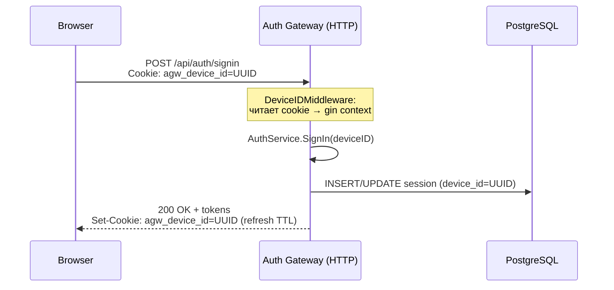
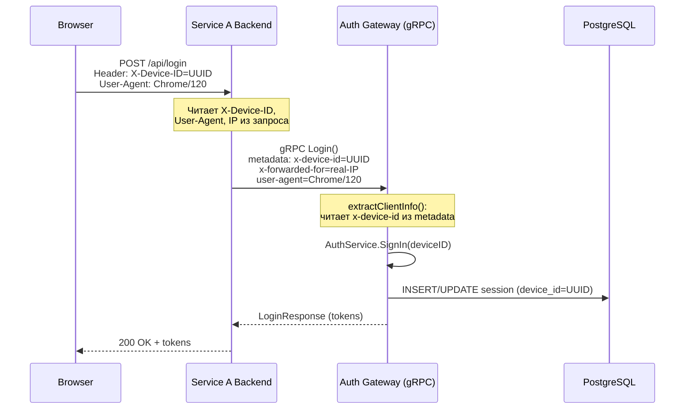
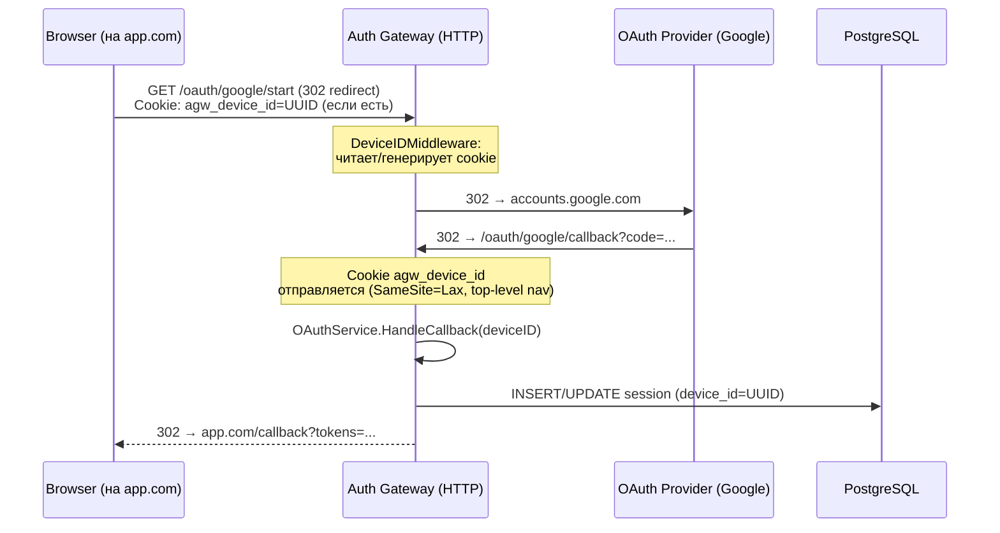
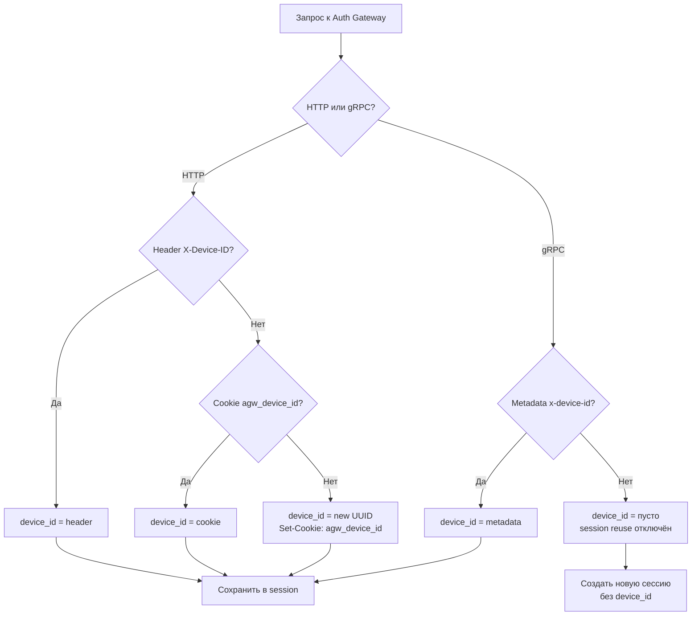
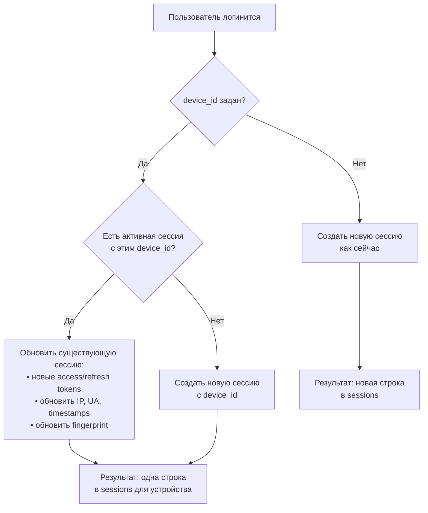

# Device ID Architecture: идентификация устройств и session reuse

> Статус: **Draft** | Дата: 2026-02-07

## Содержание

1. [Проблема](#проблема)
2. [Архитектурные паттерны взаимодействия](#архитектурные-паттерны-взаимодействия)
3. [Предложенное решение](#предложенное-решение)
4. [Диаграммы потоков](#диаграммы-потоков)
5. [Приоритет идентификации устройства](#приоритет-идентификации-устройства)
6. [Session Reuse](#session-reuse)
7. [Подводные камни и edge cases](#подводные-камни-и-edge-cases)
8. [Открытые вопросы](#открытые-вопросы)
9. [План реализации (summary)](#план-реализации)
10. [Затронутые файлы](#затронутые-файлы)

---

## Проблема

### Текущее состояние

Login Alert уже реализован: при логине вычисляется серверный fingerprint `desktop:macos:chrome` и проверяется через
Redis SET. Если устройство новое — отправляется email-уведомление.

Однако:

| Проблема                             | Описание                                                                                                                          |
|--------------------------------------|-----------------------------------------------------------------------------------------------------------------------------------|
| **Fingerprint не хранится в БД**     | `sessions` таблица не содержит `device_id` или `device_fingerprint`. Невозможно сопоставить сессию с устройством.                 |
| **Нет session reuse**                | Каждый логин создаёт **новую** сессию, даже если пользователь логинится 10 раз с одного браузера. Это засоряет список сессий.     |
| **Нет кросс-доменной идентификации** | Когда пользователь переходит с `app1.com` на `app2.com`, gateway не может узнать, что это одно устройство.                        |
| **gRPC-клиенты неразличимы**         | Все gRPC-запросы выглядят как `grpc_client` — нет способа различить устройства пользователей, аутентифицируемых через gRPC proxy. |

### Что уже есть в кодовой базе

- `computeFingerprint()` в `login_alert_service.go` — серверный fingerprint (strip version + hash)
- Cookie-паттерн: `SetCookie` в `login_handler.go` (auth_session, otp_login_state, oauth_state)
- CORS с `AllowCredentials: true` — поддерживает cross-origin cookies
- gRPC metadata extraction: `extractClientInfo()` в `grpc/handler.go` читает `x-forwarded-for`, `x-client-name`,
  `x-application-id`
- `SessionStore.GetUserSessions()` — все активные сессии пользователя
- `RefreshSessionTokens()` — паттерн обновления существующей сессии
- `utils.GetClientIP()`, `utils.GetUserAgent()`, `utils.GetDeviceInfoFromContext()` — утилиты

---

## Архитектурные паттерны взаимодействия

Auth Gateway поддерживает **три** паттерна доставки запросов аутентификации:

### Путь A: Прямой HTTP (Browser → Gateway)

Браузер пользователя напрямую обращается к REST API gateway.



**Примеры:**

- Пользователь открывает страницу логина на домене gateway
- OAuth redirect (302) на gateway: `app.com → gateway/oauth/google/callback`
- Прямая интеграция через Client SDK (REST)

### Путь B: gRPC Proxy (Browser → Service A → Gateway)

Бэкенд Сервиса А проксирует аутентификацию через gRPC.



**Примеры:**

- Микросервис со своим фронтендом и бэкендом
- BFF (Backend-for-Frontend) паттерн
- Mobile app → App backend → Gateway

### Путь C: OAuth Redirect через Gateway

Пользователь перенаправляется на gateway для OAuth.



**Ключевой момент:** SameSite=Lax позволяет отправлять cookie при top-level navigation (redirect), что покрывает OAuth
flow.

---

## Предложенное решение

### Гибридная идентификация (Hybrid Device ID)

Три источника device_id с чётким приоритетом:



### Cookie `agw_device_id`

| Параметр     | Значение              | Обоснование                            |
|--------------|-----------------------|----------------------------------------|
| **Имя**      | `agw_device_id`       | Префикс `agw_` для namespace isolation |
| **Значение** | UUID v4               | Непредсказуемый, уникальный            |
| **MaxAge**   | 2 года (63072000 сек) | Долгоживущий идентификатор устройства  |
| **Path**     | `/`                   | Доступен для всех endpoints gateway    |
| **Domain**   | пустой                | Текущий домен gateway (first-party)    |
| **HttpOnly** | `true`                | Не читается JavaScript (защита от XSS) |
| **Secure**   | `true` (prod)         | Только HTTPS                           |
| **SameSite** | `Lax`                 | Отправляется при top-level navigation  |

**Почему SameSite=Lax, а не None:**

- `Lax` — cookie отправляется при top-level navigation (302 redirect), что покрывает OAuth flows
- `None` — cookie отправляется при **любом** cross-site request, включая ``, `<iframe>`. Это избыточно и создаёт
  риски.
- `None` требует `Secure: true` обязательно (Chrome блокирует иначе)
- `Lax` — оптимальный баланс безопасности и функциональности

**Почему first-party cookie, а не third-party:**

- Third-party cookies (cross-domain) массово блокируются браузерами (Safari ITP, Chrome Privacy Sandbox)
- First-party cookie на домене gateway стабильна и работает везде
- Для cross-domain: все auth flows проходят через redirect на домен gateway → cookie доступна

### gRPC Metadata `x-device-id`

Для паттерна B (Service A → gRPC → Gateway):

```
gRPC metadata:
  x-device-id:      "550e8400-e29b-41d4-a716-446655440000"
  x-forwarded-for:  "real-user-ip"
  user-agent:        "real-user-agent"
  x-application-id:  "app-uuid"
```

**Ответственность бэкенда Сервиса А:**

1. Принять `X-Device-ID` header от фронтенда (или от Client SDK)
2. Пробросить в gRPC metadata как `x-device-id`
3. Пробросить реальные IP и User-Agent пользователя (а не свои)

**Ответственность Client SDK (опционально):**

1. Сгенерировать UUID при первом запуске
2. Сохранить в cookie на домене Сервиса А (или localStorage)
3. Отправлять `X-Device-ID` header в каждом запросе к бэкенду Сервиса А

---

## Приоритет идентификации устройства

### HTTP запросы (DeviceIDMiddleware)

```
Приоритет:
1. Header X-Device-ID     — SDK/мобильное приложение явно передаёт
2. Cookie agw_device_id   — браузер напрямую к gateway
3. Новый UUID             — первый визит, устанавливается cookie
```

Header имеет приоритет выше cookie, потому что:

- SDK **осознанно** передаёт device_id (может быть из native storage мобильного приложения)
- Cookie — автоматический механизм, может быть "чужим" (shared device)

### gRPC запросы (extractClientInfo)

```
Приоритет:
1. Metadata x-device-id   — передано бэкендом Сервиса А
2. Пусто                  — device_id не задан, session reuse отключён
```

Нет fallback-генерации UUID, потому что:

- gRPC-клиент не может получить обратно сгенерированный cookie
- Лучше явно: нет device_id → нет reuse (обратная совместимость)

### Fingerprint (дополнительно)

Серверный fingerprint `computeFingerprint()` хранится в `device_fingerprint` для analytics:

- Вычисляется: `hash(deviceType:osFamily:browserFamily)` (без версий)
- Не используется для session reuse (слишком грубый)
- Используется для login alerts (уже реализовано)
- Полезен для аналитики: "сколько уникальных типов устройств у пользователя"

---

## Session Reuse

### Как работает



### SQL-запрос для поиска сессии

```sql
SELECT *
FROM sessions
WHERE user_id = $1
  AND device_id = $2
  AND revoked_at IS NULL
  AND expires_at > NOW()
ORDER BY last_active_at DESC
LIMIT 1;
```

### Что обновляется при reuse

| Поле                 | Обновляется? | Комментарий                        |
|----------------------|--------------|------------------------------------|
| `token_hash`         | Да           | Новый refresh token                |
| `access_token_hash`  | Да           | Новый access token                 |
| `ip_address`         | Да           | Может измениться (Wi-Fi/мобильный) |
| `user_agent`         | Да           | Может обновиться браузер           |
| `device_fingerprint` | Да           | Пересчитывается                    |
| `last_active_at`     | Да           | Текущее время                      |
| `expires_at`         | Да           | Новый TTL                          |
| `device_id`          | Нет          | Не меняется                        |
| `device_type`        | Да           | Может уточниться                   |
| `os`                 | Да           | Может обновиться версия            |
| `browser`            | Да           | Может обновиться версия            |
| `session_name`       | Да           | Пересчитывается                    |

### Результат

**До (текущее поведение):**

```
sessions:
  id=aaa, user=John, device=Chrome/Windows, created=Mon
  id=bbb, user=John, device=Chrome/Windows, created=Tue  ← дубликат!
  id=ccc, user=John, device=Chrome/Windows, created=Wed  ← дубликат!
  id=ddd, user=John, device=Safari/macOS, created=Thu
```

**После (с session reuse):**

```
sessions:
  id=aaa, user=John, device_id=UUID-1, device=Chrome/Windows, updated=Wed  ← одна!
  id=ddd, user=John, device_id=UUID-2, device=Safari/macOS, created=Thu
```

---

## Подводные камни и edge cases

### 1. Cookie заблокирован браузером

**Ситуация:** Пользователь заблокировал cookies или использует privacy-расширение.

**Поведение:**

- Middleware не найдёт cookie
- Если нет header `X-Device-ID` → генерируется новый UUID каждый раз
- `Set-Cookie` вызывается, но браузер его игнорирует
- Каждый логин — новая сессия (как сейчас)

**Влияние:** Минимальное. Поведение деградирует до текущего.

### 2. Incognito/Private Mode

**Ситуация:** Пользователь логинится в incognito.

**Поведение:**

- Нет сохранённой cookie → генерируется новый UUID
- Cookie живёт только до закрытия incognito-окна
- При повторном открытии incognito → новый UUID, новая сессия

**Это корректно:** incognito = новый контекст = новая сессия.

### 3. Очистка cookies пользователем

**Ситуация:** Пользователь очищает cookies в настройках браузера.

**Поведение:**

- `agw_device_id` удаляется
- При следующем визите → новый UUID, новая сессия
- Login alert отправится (новый fingerprint, хотя устройство то же)
- Старая сессия с предыдущим device_id остаётся (expiry/revoke)

**Приемлемо:** Это осознанное действие пользователя.

### 4. Несколько вкладок одного браузера

**Ситуация:** Пользователь открывает 5 вкладок и логинится в каждой.

**Поведение:**

- Все вкладки шарят одну cookie → один device_id
- Первый логин → создаётся сессия
- Последующие 4 логина → reuse той же сессии
- Результат: 1 сессия, 5 пар токенов (последняя пара актуальна)

**Нюанс:** Предыдущие access/refresh tokens станут невалидными при reuse. Если пользователь имел активную сессию в
другой вкладке, она "протухнет". Refresh flow должен корректно обрабатывать это.

### 5. Shared device (компьютер в офисе)

**Ситуация:** Два пользователя логинятся на одном компьютере.

**Поведение:**

- Один `agw_device_id` cookie
- User A логинится → сессия для User A с device_id=X
- User B логинится → сессия для User B с device_id=X
- Reuse ищет по `(user_id, device_id)` → разные user_id, разные сессии

**Корректно:** device_id привязывается к (user, device), не просто к device.

### 6. Миграция: старые сессии без device_id

**Ситуация:** После деплоя в БД есть сессии с `device_id IS NULL`.

**Поведение:**

- Reuse ищет `WHERE device_id = $1` → не найдёт NULL-сессии
- Новые логины создадут сессии с device_id
- Старые сессии протухнут по expires_at
- Постепенная миграция: через 7 дней (TTL refresh token) все сессии будут с device_id

**Нет необходимости** в backfill-миграции.

### 7. gRPC-клиент не передаёт device_id

**Ситуация:** Сервис А не обновлён и не шлёт `x-device-id` metadata.

**Поведение:**

- `extractClientInfo()` → DeviceID пуст
- Session reuse пропускается
- Создаётся новая сессия без device_id (как сейчас)

**Полная обратная совместимость.**

### 8. Подмена device_id

**Ситуация:** Злоумышленник отправляет чужой device_id.

**Поведение:**

- device_id без аутентификации бессмысленен
- Reuse работает по `(user_id, device_id)` — нужно знать и пароль
- Злоумышленник не может "захватить" чужую сессию через device_id
- Максимум — его сессия "склеится" с другой его же сессией

**Безопасность не нарушается:** device_id — идентификатор устройства, не credential.

### 9. Client SDK генерирует device_id, но бэкенд Сервиса А не пробрасывает

**Ситуация:** Фронт отправляет `X-Device-ID`, но бэкенд Сервиса А его игнорирует.

**Поведение:**

- Gateway не получает device_id → session reuse отключён
- Работает как сейчас

**Рекомендация:** Документировать в SDK guide, что `X-Device-ID` нужно пробрасывать.

### 10. Race condition при параллельных логинах

**Ситуация:** Два запроса на логин с одним device_id приходят одновременно.

**Поведение:**

- Оба находят одну сессию для reuse
- Один обновляет session первым
- Второй тоже обновляет (перезаписывает токены)
- Результат: последний выигрывает

**Приемлемо:** Параллельный логин с одного устройства — аномальный сценарий. Последний токен будет рабочим.

---

## Принятые решения

### 1. Возвращать `device_id` в auth response — ДА

Gateway возвращает `device_id` в ответе на аутентификацию. Это позволяет:

- Client SDK сохранить device_id, сгенерированный сервером (если клиент не передал свой)
- Подтвердить клиенту, какой device_id ассоциирован с сессией
- Синхронизировать device_id между REST и gRPC путями

**Изменения в API:**

HTTP response (`models.AuthResponse`):

```json
{
  "access_token": "...",
  "refresh_token": "...",
  "expires_in": 900,
  "device_id": "550e8400-e29b-41d4-a716-446655440000",
  "user": {
    ...
  }
}
```

gRPC response (`LoginResponse`, `CreateUserResponse`):

```protobuf
message LoginResponse {
  // ... existing fields
  string device_id = 7;
}
```

**Логика:**

- Если клиент передал device_id → возвращаем его же (echo)
- Если клиент не передал → возвращаем серверный fingerprint-based ID (или пустую строку)

### 2. Ревокация всех сессий устройства — ДА

Добавить endpoint для отзыва всех сессий конкретного устройства.

**HTTP API:**

```
DELETE /api/sessions/device/{device_id}
```

**SQL:**

```sql
UPDATE sessions
SET revoked_at = NOW()
WHERE device_id = $1
  AND user_id = $2
  AND revoked_at IS NULL;
```

**Права доступа:**

- Пользователь может ревокировать только свои сессии (по `user_id` из JWT)
- Админ может ревокировать сессии любого пользователя

**Файлы:**

- `handler/session_handler.go`: новый handler `RevokeDeviceSessions`
- `service/session_service.go`: новый метод `RevokeSessionsByDevice`
- `repository/session_repository.go`: новый метод `RevokeByDevice`
- `service/interfaces.go`: +`RevokeByDevice` в SessionStore
- `cmd/server.go`: новый route

## Открытые вопросы

### 1. Лимит сессий на устройство

Нужно ли ограничивать количество активных сессий для одного device_id?

**Предварительное решение:** Нет. Session reuse и так сводит к одной сессии на устройство.

### 2. Синхронизация device_id между Client SDK (REST) и gRPC proxy

Если приложение использует оба пути (REST для фронтенда, gRPC для бэкенда), device_id должен быть одинаковым.

**Решение:** Client SDK генерирует UUID и отправляет его в обе стороны. Gateway всегда возвращает `device_id` в
response, так что SDK может подтвердить/сохранить его.

---

## План реализации

### Шаг 1. DB Migration

Новый файл: `internal/migrations/016_session_device_tracking.go`

```sql
ALTER TABLE sessions
    ADD COLUMN device_id VARCHAR(64);
ALTER TABLE sessions
    ADD COLUMN device_fingerprint VARCHAR(128);
CREATE INDEX idx_sessions_device_id ON sessions (user_id, device_id) WHERE revoked_at IS NULL;
CREATE INDEX idx_sessions_device_fingerprint ON sessions (user_id, device_fingerprint) WHERE revoked_at IS NULL;
```

### Шаг 2. Models & Params

- `models/session.go`: +`DeviceID`, +`DeviceFingerprint` в Session и ActiveSessionResponse
- `service/session_service.go`: +`DeviceID`, +`DeviceFingerprint` в SessionCreationParams

### Шаг 3. HTTP DeviceID Middleware

Новый файл: `middleware/device.go` — cookie + header → gin context

### Шаг 4. Utils

`utils/context.go`: +`GetDeviceID()` для HTTP handler

### Шаг 5. gRPC: extractClientInfo

`grpc/handler.go`: +`DeviceID` в ClientInfo, чтение `x-device-id` из gRPC metadata

### Шаг 6. Session Reuse в SessionService

- `session_service.go`: логика поиска + reuse существующей сессии
- `interfaces.go`: +`FindActiveByUserAndDevice` в SessionStore
- `repository/session_repository.go`: +`FindActiveByUserAndDevice` метод

### Шаг 7. Пробросить device_id через auth flow

- `handler/auth_handler.go`: `utils.GetDeviceID(c)` → сервис
- `handler/oauth_handler.go`: `utils.GetDeviceID(c)` → сервис
- `grpc/handler.go`: `clientInfo.DeviceID` → сервис
- `service/auth_service.go`: +`deviceID` параметр в `generateAuthResponse()`
- `service/oauth_service.go`: +`deviceID` параметр в `HandleCallback()`

### Шаг 8. Возвращать device_id в auth response

- `models/auth.go`: +`DeviceID` поле в `AuthResponse`
- `service/auth_service.go`: заполнять `DeviceID` в `generateAuthResponse()`
- `proto/auth.proto`: +`device_id` в `LoginResponse`, `CreateUserResponse`
- `grpc/handler.go`: маппинг `authResp.DeviceID` → proto response

### Шаг 9. Endpoint ревокации сессий устройства

- `handler/session_handler.go`: +`RevokeDeviceSessions` handler (`DELETE /api/sessions/device/:device_id`)
- `service/session_service.go`: +`RevokeSessionsByDevice(ctx, userID, deviceID)`
- `repository/session_repository.go`: +`RevokeByDevice(ctx, userID, deviceID)`
- `service/interfaces.go`: +`RevokeByDevice` в SessionStore
- `cmd/server.go`: регистрация route

### Шаг 10. Подключить middleware в router

`cmd/server.go`: `router.Use(middleware.DeviceIDMiddleware(...))` после CORS

---

## Затронутые файлы

| Файл                                                 | Изменение                                                   |
|------------------------------------------------------|-------------------------------------------------------------|
| `internal/migrations/016_session_device_tracking.go` | **Новый**: миграция                                         |
| `internal/middleware/device.go`                      | **Новый**: DeviceIDMiddleware                               |
| `internal/models/session.go`                         | +поля DeviceID, DeviceFingerprint                           |
| `internal/models/auth.go`                            | +DeviceID в AuthResponse                                    |
| `internal/service/session_service.go`                | Session reuse + RevokeSessionsByDevice                      |
| `internal/service/interfaces.go`                     | +FindActiveByUserAndDevice, +RevokeByDevice                 |
| `internal/repository/session_repository.go`          | +FindActiveByUserAndDevice, +RevokeByDevice                 |
| `internal/utils/context.go`                          | +GetDeviceID()                                              |
| `internal/handler/auth_handler.go`                   | Проброс deviceID                                            |
| `internal/handler/oauth_handler.go`                  | Проброс deviceID                                            |
| `internal/handler/session_handler.go`                | +RevokeDeviceSessions handler                               |
| `internal/grpc/handler.go`                           | +DeviceID в ClientInfo, чтение metadata, маппинг в response |
| `proto/auth.proto`                                   | +device_id в LoginResponse, CreateUserResponse              |
| `internal/service/auth_service.go`                   | +deviceID параметр, DeviceID в response                     |
| `internal/service/oauth_service.go`                  | +deviceID параметр                                          |
| `internal/service/mocks_test.go`                     | +mock FindActiveByUserAndDevice, RevokeByDevice             |
| `cmd/server.go`                                      | Подключение middleware + route ревокации                    |

---

## Верификация

1. `go build ./...` — компиляция
2. `make proto-gen` — генерация gRPC кода (после изменения proto)
3. `go test ./internal/service/` — все тесты
4. `go test ./internal/repository/` — тесты репозитория
5. Ручная проверка:
    - **HTTP**: Логин → cookie установлена, session.device_id заполнен, response содержит device_id
    - **HTTP**: Повторный логин → та же session обновилась (не новая строка)
    - **gRPC**: Login с `x-device-id` metadata → session с device_id, response содержит device_id
    - **gRPC**: Login без `x-device-id` → session без device_id (обратная совместимость)
    - **OAuth**: Redirect flow → cookie `agw_device_id` отправляется (SameSite=Lax)
    - **Login Alert**: Новое устройство → email отправлен
    - **Ревокация**: `DELETE /api/sessions/device/{id}` → все сессии устройства revoked
