# Headless Identity Provider — Архитектура мультисервисной интеграции

## Оглавление

- [1. Обзор](#1-обзор)
- [2. Общая архитектура](#2-общая-архитектура)
- [3. Регистрация продукта](#3-регистрация-продукта)
- [4. Flows аутентификации](#4-flows-аутентификации)
    - [4.1 OTP Email flow](#41-otp-email-flow)
    - [4.2 Email + Password flow](#42-email--password-flow)
    - [4.3 Универсальный flow (выбор метода)](#43-универсальный-flow-выбор-метода)
- [5. Валидация токенов (защита эндпоинтов)](#5-валидация-токенов-защита-эндпоинтов)
- [6. SSO между продуктами](#6-sso-между-продуктами)
    - [6.1 Shared Cookie (поддомены)](#61-shared-cookie-поддомены)
    - [6.2 Token Exchange (разные домены)](#62-token-exchange-разные-домены)
- [7. Хранение данных в продуктах](#7-хранение-данных-в-продуктах)
- [8. Получение данных о пользователе](#8-получение-данных-о-пользователе)
- [9. Миграция существующих пользователей](#9-миграция-существующих-пользователей)
- [10. Каналы связи (gRPC vs REST)](#10-каналы-связи-grpc-vs-rest)
- [11. Доработки auth-gateway](#11-доработки-auth-gateway)

---

## 1. Обзор

### Проблема

В компании несколько продуктов, каждый со своей базой данных. Глобально пользователь один, но в каждом продукте есть
своя таблица `users`, дублирующая данные. Разные продукты используют разные методы аутентификации (OTP, пароль и т.д.).

### Решение

Auth Gateway работает как **Headless Identity Provider** — невидимый для пользователя бэкенд-сервис аутентификации.
Каждый продукт сохраняет свой UI и UX логина, но делегирует проверку credentials в Auth Gateway.

### Ключевые принципы

| Принцип               | Описание                                                                                                              |
|-----------------------|-----------------------------------------------------------------------------------------------------------------------|
| **Headless**          | Пользователь никогда не видит auth-gateway, каждый продукт имеет свой UI логина                                       |
| **Single Identity**   | Один пользователь (UUID) на всю экосистему, без дублирования                                                          |
| **Per-App Config**    | Каждый продукт настраивает свои методы аутентификации, роли, брендинг                                                 |
| **Foreign Reference** | Продукты хранят только `user_id` (UUID), не таблицу `users`                                                           |
| **Backend Proxy**     | Фронтенд продукта → Бэкенд продукта → Auth Gateway (credentials никогда не идут от фронтенда к auth-gateway напрямую) |

---

## 2. Общая архитектура

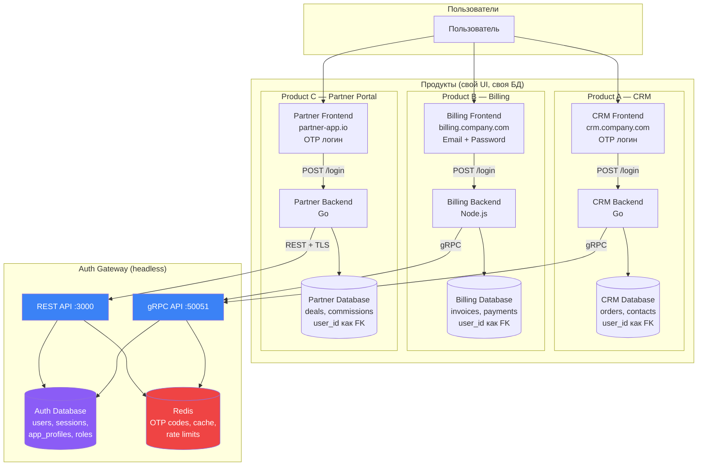
```mermaid
graph TB
    subgraph "Пользователи"
        U1[Пользователь]
    end

    subgraph "Продукты (свой UI, своя БД)"
        subgraph "Product A — CRM"
            A_UI[CRM Frontend<br/>crm.company.com<br/>OTP логин]
            A_BE[CRM Backend<br/>Go]
            A_DB[(CRM Database<br/>orders, contacts<br/>user_id как FK)]
        end

        subgraph "Product B — Billing"
            B_UI[Billing Frontend<br/>billing.company.com<br/>Email + Password]
            B_BE[Billing Backend<br/>Node.js]
            B_DB[(Billing Database<br/>invoices, payments<br/>user_id как FK)]
        end

        subgraph "Product C — Partner Portal"
            C_UI[Partner Frontend<br/>partner-app.io<br/>OTP логин]
            C_BE[Partner Backend<br/>Go]
            C_DB[(Partner Database<br/>deals, commissions<br/>user_id как FK)]
        end
    end

    subgraph "Auth Gateway (headless)"
        AG_REST[REST API :3000]
        AG_GRPC[gRPC API :50051]
        AG_DB[(Auth Database<br/>users, sessions,<br/>app_profiles, roles)]
        AG_REDIS[(Redis<br/>OTP codes, cache,<br/>rate limits)]
    end

    U1 --> A_UI
    U1 --> B_UI
    U1 --> C_UI
    A_UI -->|POST /login| A_BE
    B_UI -->|POST /login| B_BE
    C_UI -->|POST /login| C_BE
    A_BE -->|gRPC| AG_GRPC
    B_BE -->|gRPC| AG_GRPC
    C_BE -->|REST + TLS| AG_REST
    A_BE --> A_DB
    B_BE --> B_DB
    C_BE --> C_DB
    AG_REST --> AG_DB
    AG_GRPC --> AG_DB
    AG_REST --> AG_REDIS
    AG_GRPC --> AG_REDIS
    style AG_REST fill: #3B82F6, color: #fff
    style AG_GRPC fill: #3B82F6, color: #fff
    style AG_DB fill: #8B5CF6, color: #fff
    style AG_REDIS fill: #EF4444, color: #fff
```

### Потоки данных

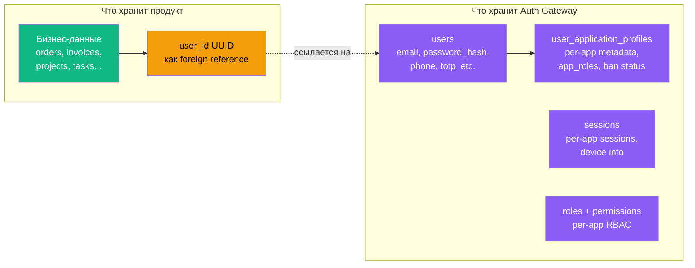
```mermaid
graph LR
    subgraph "Что хранит Auth Gateway"
        AUTH_USERS[users<br/>email, password_hash,<br/>phone, totp, etc.]
        AUTH_PROFILES[user_application_profiles<br/>per-app metadata,<br/>app_roles, ban status]
        AUTH_SESSIONS[sessions<br/>per-app sessions,<br/>device info]
        AUTH_ROLES[roles + permissions<br/>per-app RBAC]
    end

    subgraph "Что хранит продукт"
        PROD_BIZ[Бизнес-данные<br/>orders, invoices,<br/>projects, tasks...]
        PROD_REF[user_id UUID<br/>как foreign reference]
    end

    AUTH_USERS --> AUTH_PROFILES
    PROD_BIZ --> PROD_REF
    PROD_REF -.->|ссылается на| AUTH_USERS
    style AUTH_USERS fill: #8B5CF6, color: #fff
    style AUTH_PROFILES fill: #8B5CF6, color: #fff
    style AUTH_SESSIONS fill: #8B5CF6, color: #fff
    style AUTH_ROLES fill: #8B5CF6, color: #fff
    style PROD_BIZ fill: #10B981, color: #fff
    style PROD_REF fill: #F59E0B, color: #000
```

---

## 3. Регистрация продукта

Перед интеграцией продукт должен быть зарегистрирован в auth-gateway.

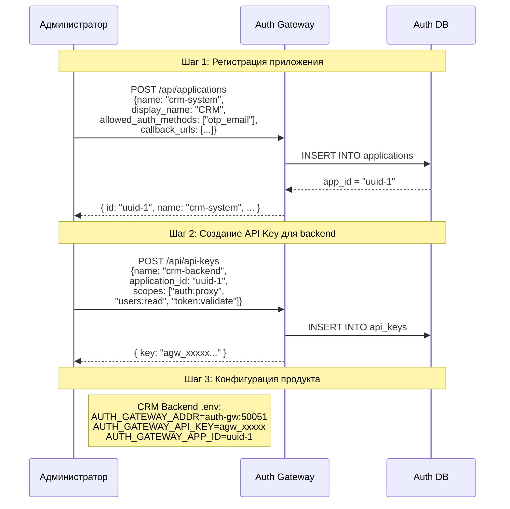
```mermaid
sequenceDiagram
    participant Admin as Администратор
    participant AG as Auth Gateway
    participant DB as Auth DB
    Note over Admin, DB: Шаг 1: Регистрация приложения
    Admin ->> AG: POST /api/applications<br/>{name: "crm-system",<br/>display_name: "CRM",<br/>allowed_auth_methods: ["otp_email"],<br/>callback_urls: [...]}
    AG ->> DB: INSERT INTO applications
    DB -->> AG: app_id = "uuid-1"
    AG -->> Admin: { id: "uuid-1", name: "crm-system", ... }
    Note over Admin, DB: Шаг 2: Создание API Key для backend
    Admin ->> AG: POST /api/api-keys<br/>{name: "crm-backend",<br/>application_id: "uuid-1",<br/>scopes: ["auth:proxy",<br/>"users:read", "token:validate"]}
    AG ->> DB: INSERT INTO api_keys
    AG -->> Admin: { key: "agw_xxxxx..." }
    Note over Admin, DB: Шаг 3: Конфигурация продукта
    Note right of Admin: CRM Backend .env:<br/>AUTH_GATEWAY_ADDR=auth-gw:50051<br/>AUTH_GATEWAY_API_KEY=agw_xxxxx<br/>AUTH_GATEWAY_APP_ID=uuid-1
```

### Конфигурация Application

```json
{
  "name": "crm-system",
  "display_name": "CRM System",
  "homepage_url": "https://crm.company.com",
  "callback_urls": [
    "https://crm.company.com/callback"
  ],
  "allowed_auth_methods": [
    "otp_email"
  ],
  "is_active": true
}
```

### Допустимые значения `allowed_auth_methods`

| Метод          | Описание                   | Пример продукта           |
|----------------|----------------------------|---------------------------|
| `password`     | Email + пароль             | Billing Portal            |
| `otp_email`    | OTP код на email           | CRM, Partner Portal       |
| `otp_sms`      | OTP код по SMS             | Mobile App                |
| `oauth_google` | Вход через Google          | Public SaaS               |
| `oauth_github` | Вход через GitHub          | Dev Tools                 |
| `oauth_yandex` | Вход через Яндекс          | RU-продукты               |
| `totp`         | 2FA (Google Authenticator) | Как дополнение к password |
| `api_key`      | Service-to-service         | Внутренние сервисы        |

---

## 4. Flows аутентификации

### 4.1 OTP Email flow

Для продуктов, где аутентификация — только по коду из email.

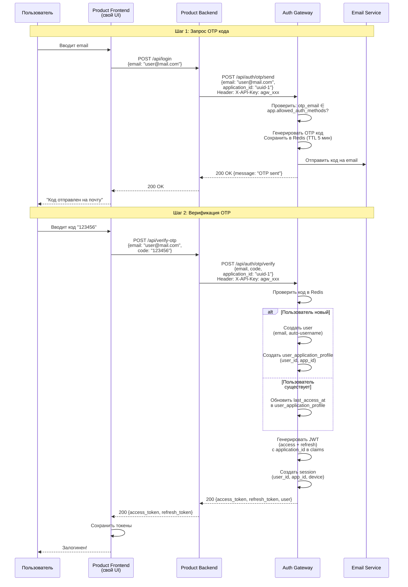
```mermaid
sequenceDiagram
    participant User as Пользователь
    participant FE as Product Frontend<br/>(свой UI)
    participant BE as Product Backend
    participant AG as Auth Gateway
    participant Mail as Email Service
    Note over User, Mail: Шаг 1: Запрос OTP кода
    User ->> FE: Вводит email
    FE ->> BE: POST /api/login<br/>{email: "user@mail.com"}
    BE ->> AG: POST /api/auth/otp/send<br/>{email: "user@mail.com",<br/>application_id: "uuid-1"}<br/>Header: X-API-Key: agw_xxx
    AG ->> AG: Проверить: otp_email ∈<br/>app.allowed_auth_methods?
    AG ->> AG: Генерировать OTP код<br/>Сохранить в Redis (TTL 5 мин)
    AG ->> Mail: Отправить код на email
    AG -->> BE: 200 OK {message: "OTP sent"}
    BE -->> FE: 200 OK
    FE -->> User: "Код отправлен на почту"
    Note over User, Mail: Шаг 2: Верификация OTP
    User ->> FE: Вводит код "123456"
    FE ->> BE: POST /api/verify-otp<br/>{email: "user@mail.com",<br/>code: "123456"}
    BE ->> AG: POST /api/auth/otp/verify<br/>{email, code,<br/>application_id: "uuid-1"}<br/>Header: X-API-Key: agw_xxx
    AG ->> AG: Проверить код в Redis

    alt Пользователь новый
        AG ->> AG: Создать user<br/>(email, auto-username)
        AG ->> AG: Создать user_application_profile<br/>(user_id, app_id)
    else Пользователь существует
        AG ->> AG: Обновить last_access_at<br/>в user_application_profile
    end

    AG ->> AG: Генерировать JWT<br/>(access + refresh)<br/>с application_id в claims
    AG ->> AG: Создать session<br/>(user_id, app_id, device)
    AG -->> BE: 200 {access_token, refresh_token, user}
    BE -->> FE: 200 {access_token, refresh_token}
    FE ->> FE: Сохранить токены
    FE -->> User: Залогинен!
```

### 4.2 Email + Password flow

Для продуктов с классической авторизацией по паролю.

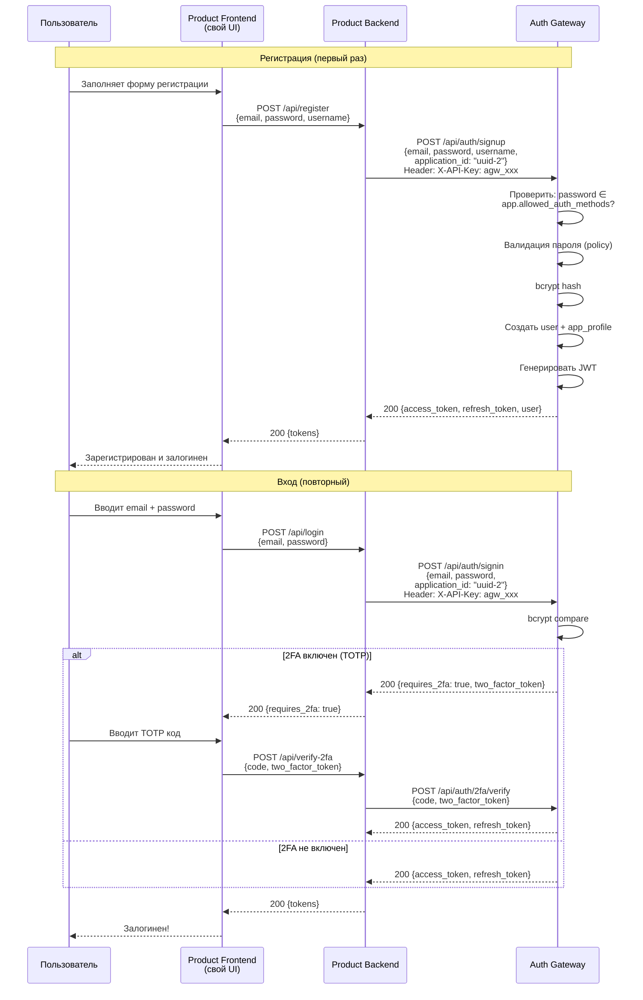
```mermaid
sequenceDiagram
    participant User as Пользователь
    participant FE as Product Frontend<br/>(свой UI)
    participant BE as Product Backend
    participant AG as Auth Gateway
    Note over User, AG: Регистрация (первый раз)
    User ->> FE: Заполняет форму регистрации
    FE ->> BE: POST /api/register<br/>{email, password, username}
    BE ->> AG: POST /api/auth/signup<br/>{email, password, username,<br/>application_id: "uuid-2"}<br/>Header: X-API-Key: agw_xxx
    AG ->> AG: Проверить: password ∈<br/>app.allowed_auth_methods?
    AG ->> AG: Валидация пароля (policy)
    AG ->> AG: bcrypt hash
    AG ->> AG: Создать user + app_profile
    AG ->> AG: Генерировать JWT
    AG -->> BE: 200 {access_token, refresh_token, user}
    BE -->> FE: 200 {tokens}
    FE -->> User: Зарегистрирован и залогинен
    Note over User, AG: Вход (повторный)
    User ->> FE: Вводит email + password
    FE ->> BE: POST /api/login<br/>{email, password}
    BE ->> AG: POST /api/auth/signin<br/>{email, password,<br/>application_id: "uuid-2"}<br/>Header: X-API-Key: agw_xxx
    AG ->> AG: bcrypt compare

    alt 2FA включен (TOTP)
        AG -->> BE: 200 {requires_2fa: true, two_factor_token}
        BE -->> FE: 200 {requires_2fa: true}
        User ->> FE: Вводит TOTP код
        FE ->> BE: POST /api/verify-2fa<br/>{code, two_factor_token}
        BE ->> AG: POST /api/auth/2fa/verify<br/>{code, two_factor_token}
        AG -->> BE: 200 {access_token, refresh_token}
    else 2FA не включен
        AG -->> BE: 200 {access_token, refresh_token}
    end

    BE -->> FE: 200 {tokens}
    FE -->> User: Залогинен!
```

### 4.3 Универсальный flow (выбор метода)

Продукт может поддерживать несколько методов. Выбор делает **фронтенд продукта**, auth-gateway валидирует допустимость.

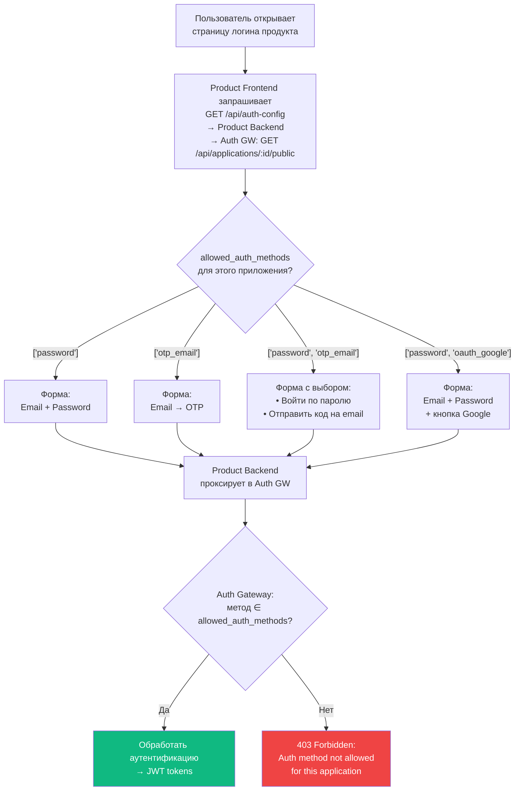
```mermaid
graph TD
    START[Пользователь открывает<br/>страницу логина продукта] --> FETCH
    FETCH[Product Frontend запрашивает<br/>GET /api/auth-config<br/>→ Product Backend<br/>→ Auth GW: GET /api/applications/:id/public]
FETCH --> CONFIG

CONFIG{allowed_auth_methods<br/>для этого приложения?}

CONFIG -->|" ['password'] "|PASS_FORM[Форма:<br/>Email + Password]
CONFIG -->|"['otp_email'] "|OTP_FORM[Форма:<br/>Email → OTP]
CONFIG -->|" ['password', 'otp_email'] "|CHOICE_FORM[Форма с выбором:<br/>• Войти по паролю<br/>• Отправить код на email]
CONFIG -->|" ['password', 'oauth_google']"|MIXED_FORM[Форма:<br/>Email + Password<br/>+ кнопка Google]

PASS_FORM --> BE_PROXY[Product Backend<br/>проксирует в Auth GW]
OTP_FORM --> BE_PROXY
CHOICE_FORM --> BE_PROXY
MIXED_FORM --> BE_PROXY

BE_PROXY --> AG_CHECK{Auth Gateway:<br/>метод ∈ allowed_auth_methods?}
AG_CHECK -->|Да|AG_PROCESS[Обработать аутентификацию<br/>→ JWT tokens]
AG_CHECK -->|Нет|AG_REJECT[403 Forbidden:<br/>Auth method not allowed<br/>for this application]

style AG_PROCESS fill: #10B981, color: #fff
style AG_REJECT fill: #EF4444, color: #fff
```

---

## 5. Валидация токенов (защита эндпоинтов)

Каждый защищённый эндпоинт продукта валидирует JWT через auth-gateway.

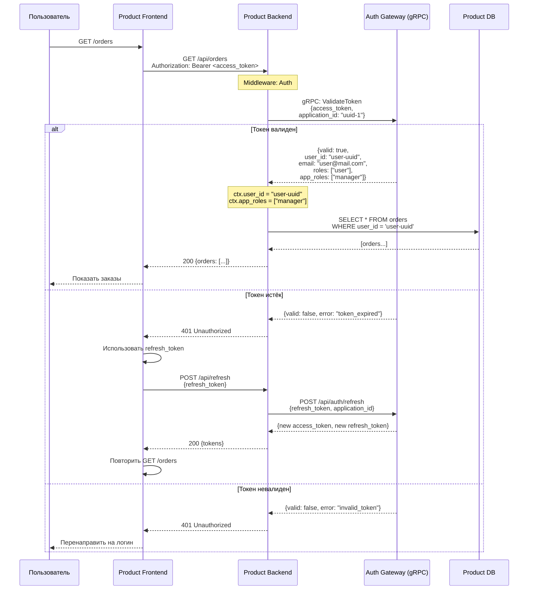
```mermaid
sequenceDiagram
    participant User as Пользователь
    participant FE as Product Frontend
    participant BE as Product Backend
    participant AG as Auth Gateway (gRPC)
    participant DB as Product DB
    User ->> FE: GET /orders
    FE ->> BE: GET /api/orders<br/>Authorization: Bearer <access_token>
    Note over BE: Middleware: Auth
    BE ->> AG: gRPC: ValidateToken<br/>{access_token,<br/>application_id: "uuid-1"}

    alt Токен валиден
        AG -->> BE: {valid: true,<br/>user_id: "user-uuid",<br/>email: "user@mail.com",<br/>roles: ["user"],<br/>app_roles: ["manager"]}
        Note over BE: ctx.user_id = "user-uuid"<br/>ctx.app_roles = ["manager"]
        BE ->> DB: SELECT * FROM orders<br/>WHERE user_id = 'user-uuid'
        DB -->> BE: [orders...]
        BE -->> FE: 200 {orders: [...]}
        FE -->> User: Показать заказы
    else Токен истёк
        AG -->> BE: {valid: false, error: "token_expired"}
        BE -->> FE: 401 Unauthorized
        FE ->> FE: Использовать refresh_token
        FE ->> BE: POST /api/refresh<br/>{refresh_token}
        BE ->> AG: POST /api/auth/refresh<br/>{refresh_token, application_id}
        AG -->> BE: {new access_token, new refresh_token}
        BE -->> FE: 200 {tokens}
        FE ->> FE: Повторить GET /orders
    else Токен невалиден
        AG -->> BE: {valid: false, error: "invalid_token"}
        BE -->> FE: 401 Unauthorized
        FE -->> User: Перенаправить на логин
    end
```

### JWT Claims структура

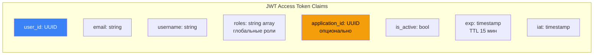
```mermaid
graph LR
    subgraph "JWT Access Token Claims"
        UID[user_id: UUID]
        EMAIL[email: string]
        UNAME[username: string]
        ROLES[roles: string array<br/>глобальные роли]
        APPID[application_id: UUID<br/>опционально]
        ACTIVE[is_active: bool]
        EXP[exp: timestamp<br/>TTL 15 мин]
        IAT[iat: timestamp]
    end

    style APPID fill: #F59E0B, color: #000
    style UID fill: #3B82F6, color: #fff
```

---

## 6. SSO между продуктами

### 6.1 Shared Cookie (поддомены)

Для продуктов на `*.company.com`.

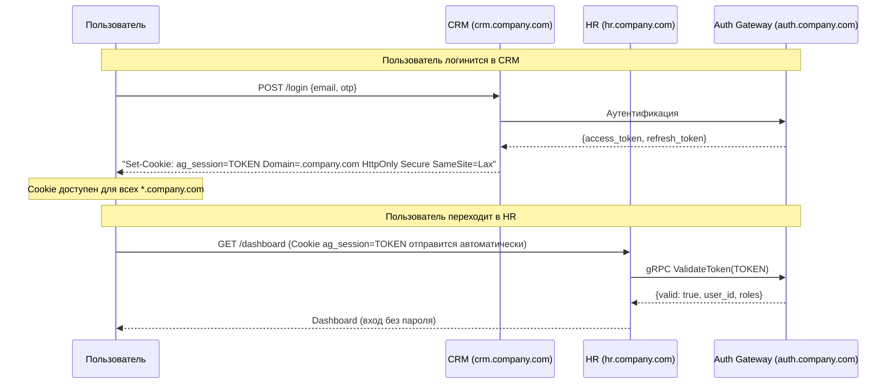
```mermaid
sequenceDiagram
    participant User as Пользователь
    participant CRM as CRM (crm.company.com)
    participant HR as HR (hr.company.com)
    participant AG as Auth Gateway (auth.company.com)
    Note over User, AG: Пользователь логинится в CRM
    User ->> CRM: POST /login {email, otp}
    CRM ->> AG: Аутентификация
    AG -->> CRM: {access_token, refresh_token}
    CRM -->> User: "Set-Cookie: ag_session=TOKEN Domain=.company.com HttpOnly Secure SameSite=Lax"
    Note over User: Cookie доступен для всех *.company.com
    Note over User, AG: Пользователь переходит в HR
    User ->> HR: GET /dashboard (Cookie ag_session=TOKEN отправится автоматически)
    HR ->> AG: gRPC ValidateToken(TOKEN)
    AG -->> HR: {valid: true, user_id, roles}
    HR -->> User: Dashboard (вход без пароля)

```

### 6.2 Token Exchange (разные домены)

Для продуктов на разных доменах (например, `partner-app.io`), где cookie не работает.

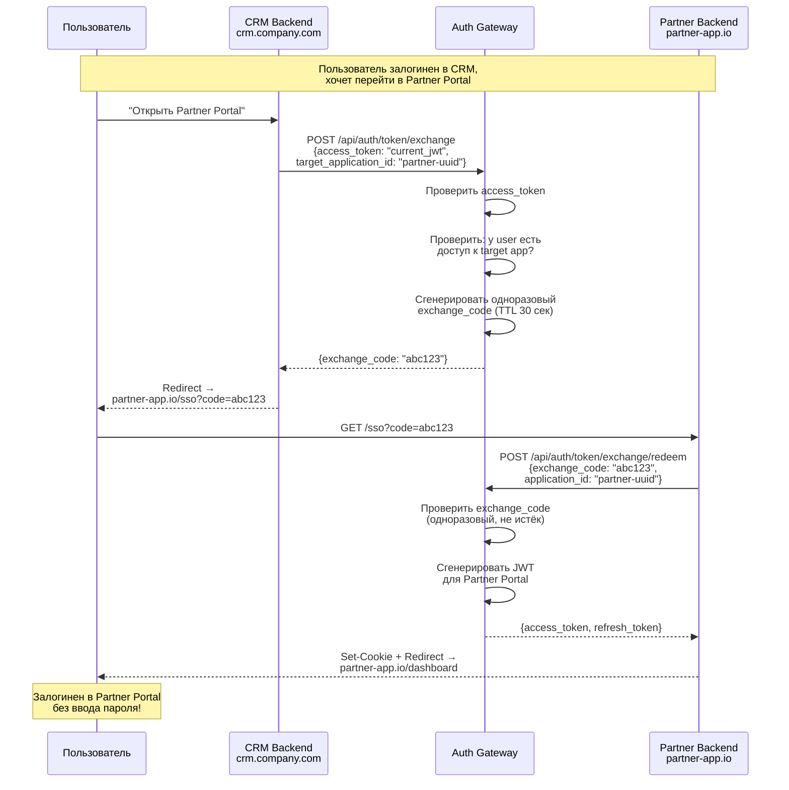
```mermaid
sequenceDiagram
    participant User as Пользователь
    participant CRM as CRM Backend<br/>crm.company.com
    participant AG as Auth Gateway
    participant Partner as Partner Backend<br/>partner-app.io
    Note over User, Partner: Пользователь залогинен в CRM,<br/>хочет перейти в Partner Portal
    User ->> CRM: "Открыть Partner Portal"
    CRM ->> AG: POST /api/auth/token/exchange<br/>{access_token: "current_jwt",<br/>target_application_id: "partner-uuid"}
    AG ->> AG: Проверить access_token
    AG ->> AG: Проверить: у user есть<br/>доступ к target app?
    AG ->> AG: Сгенерировать одноразовый<br/>exchange_code (TTL 30 сек)
    AG -->> CRM: {exchange_code: "abc123"}
    CRM -->> User: Redirect →<br/>partner-app.io/sso?code=abc123
    User ->> Partner: GET /sso?code=abc123
    Partner ->> AG: POST /api/auth/token/exchange/redeem<br/>{exchange_code: "abc123",<br/>application_id: "partner-uuid"}
    AG ->> AG: Проверить exchange_code<br/>(одноразовый, не истёк)
    AG ->> AG: Сгенерировать JWT<br/>для Partner Portal
    AG -->> Partner: {access_token, refresh_token}
    Partner -->> User: Set-Cookie + Redirect →<br/>partner-app.io/dashboard
    Note over User: Залогинен в Partner Portal<br/>без ввода пароля!
```

### Комбинированная SSO стратегия

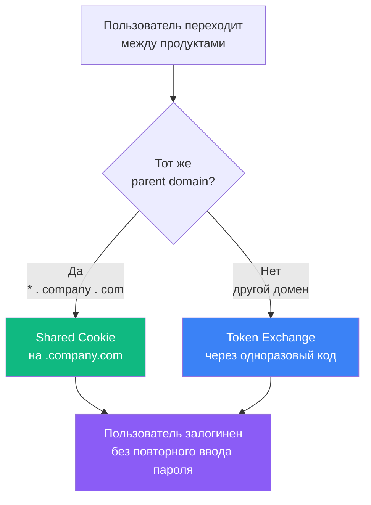
```mermaid
graph TD
    START[Пользователь переходит<br/>между продуктами] --> CHECK_DOMAIN
    CHECK_DOMAIN{Тот же<br/>parent domain?}
    CHECK_DOMAIN -->|Да<br/>* . company . com| COOKIE[Shared Cookie<br/>на .company.com]
    CHECK_DOMAIN -->|Нет<br/>другой домен| EXCHANGE[Token Exchange<br/>через одноразовый код]
    COOKIE --> RESULT[Пользователь залогинен<br/>без повторного ввода пароля]
    EXCHANGE --> RESULT
    style COOKIE fill: #10B981, color: #fff
    style EXCHANGE fill: #3B82F6, color: #fff
    style RESULT fill: #8B5CF6, color: #fff
```

---

## 7. Хранение данных в продуктах

### Принцип: никакой таблицы `users` в продуктах

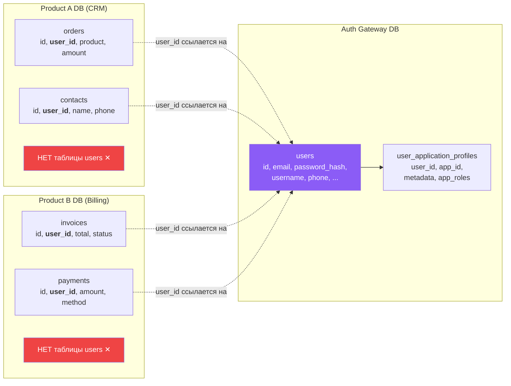
```mermaid
graph LR
    subgraph "Auth Gateway DB"
        USERS[users<br/>id, email, password_hash,<br/>username, phone, ...]
        PROFILES[user_application_profiles<br/>user_id, app_id,<br/>metadata, app_roles]
    end

subgraph "Product A DB (CRM)"
ORDERS[orders<br/>id, <b>user_id</b>, product, amount]
CONTACTS[contacts<br/>id, <b>user_id</b>, name, phone]
NO_USERS_A[НЕТ таблицы users ✕]
end

subgraph "Product B DB (Billing)"
INVOICES[invoices<br/>id, <b>user_id</b>, total, status]
PAYMENTS[payments<br/>id, <b>user_id</b>, amount, method]
NO_USERS_B[НЕТ таблицы users ✕]
end

ORDERS -.->|user_id ссылается на|USERS
CONTACTS -.->|user_id ссылается на|USERS
INVOICES -.->|user_id ссылается на|USERS
PAYMENTS -.->|user_id ссылается на|USERS
USERS --> PROFILES

style NO_USERS_A fill: #EF4444, color: #fff
style NO_USERS_B fill: #EF4444, color: #fff
style USERS fill: #8B5CF6, color: #fff
```

### SQL-схема продукта

```sql
-- Product A Database: ТОЛЬКО бизнес-данные
-- Никакой таблицы users!

CREATE TABLE orders
(
    id           UUID PRIMARY KEY DEFAULT gen_random_uuid(),
    user_id      UUID           NOT NULL, -- ← UUID из Auth Gateway
    product_name TEXT           NOT NULL,
    amount       DECIMAL(10, 2) NOT NULL,
    status       VARCHAR(50)      DEFAULT 'pending',
    created_at   TIMESTAMP        DEFAULT NOW(),
    updated_at   TIMESTAMP        DEFAULT NOW()
);

CREATE INDEX idx_orders_user_id ON orders (user_id);

-- user_id НЕ имеет FOREIGN KEY constraint,
-- т.к. users живут в другой базе данных.
-- Целостность обеспечивается через auth-gateway.
```

---

## 8. Получение данных о пользователе

Когда продукту нужно показать имя/email пользователя.

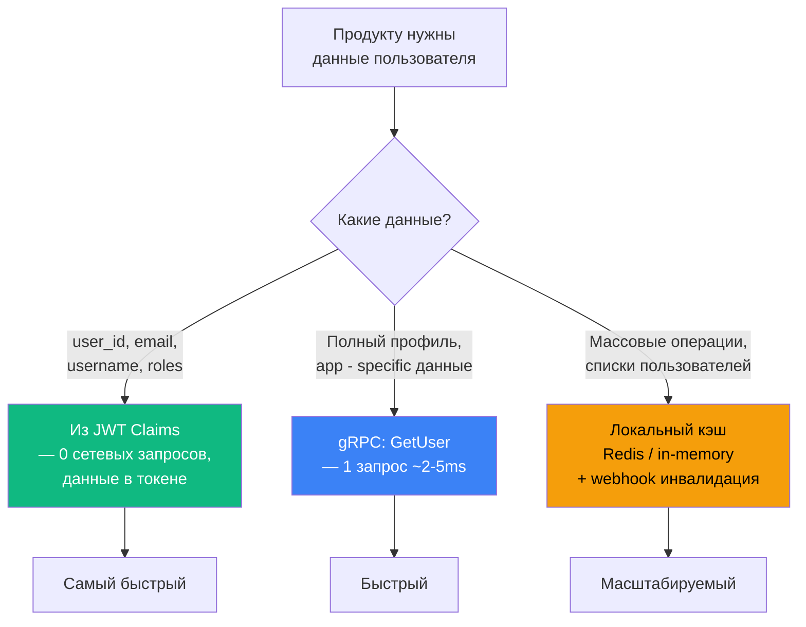
```mermaid
graph TD
    NEED[Продукту нужны<br/>данные пользователя] --> CHOOSE
    CHOOSE{Какие данные?}
    CHOOSE -->|user_id, email,<br/>username, roles| JWT[Из JWT Claims<br/>— 0 сетевых запросов,<br/>данные в токене]
CHOOSE -->|Полный профиль,<br/>app - specific данные|GRPC[gRPC: GetUser<br/>— 1 запрос ~2-5ms]
CHOOSE -->|Массовые операции,<br/>списки пользователей|CACHE[Локальный кэш<br/>Redis / in-memory<br/>+ webhook инвалидация]

JWT --> FAST[Самый быстрый]
GRPC --> MEDIUM[Быстрый]
CACHE --> SCALABLE[Масштабируемый]

style JWT fill: #10B981, color: #fff
style GRPC fill: #3B82F6, color: #fff
style CACHE fill: #F59E0B, color: #000
```

### Пример: отображение списка заказов с именами пользователей

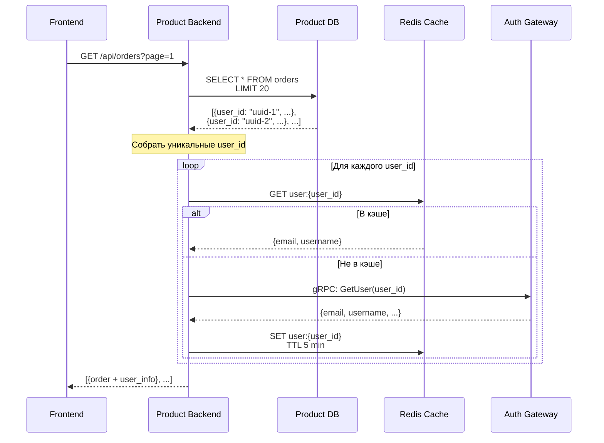
```mermaid
sequenceDiagram
    participant FE as Frontend
    participant BE as Product Backend
    participant DB as Product DB
    participant Cache as Redis Cache
    participant AG as Auth Gateway
    FE ->> BE: GET /api/orders?page=1
    BE ->> DB: SELECT * FROM orders<br/>LIMIT 20
    DB -->> BE: [{user_id: "uuid-1", ...},<br/>{user_id: "uuid-2", ...}, ...]
    Note over BE: Собрать уникальные user_id

    loop Для каждого user_id
        BE ->> Cache: GET user:{user_id}
        alt В кэше
            Cache -->> BE: {email, username}
        else Не в кэше
            BE ->> AG: gRPC: GetUser(user_id)
            AG -->> BE: {email, username, ...}
            BE ->> Cache: SET user:{user_id}<br/>TTL 5 min
        end
    end

    BE -->> FE: [{order + user_info}, ...]
```

---

## 9. Миграция существующих пользователей

Для продуктов, которые уже в проде со своими таблицами `users`.

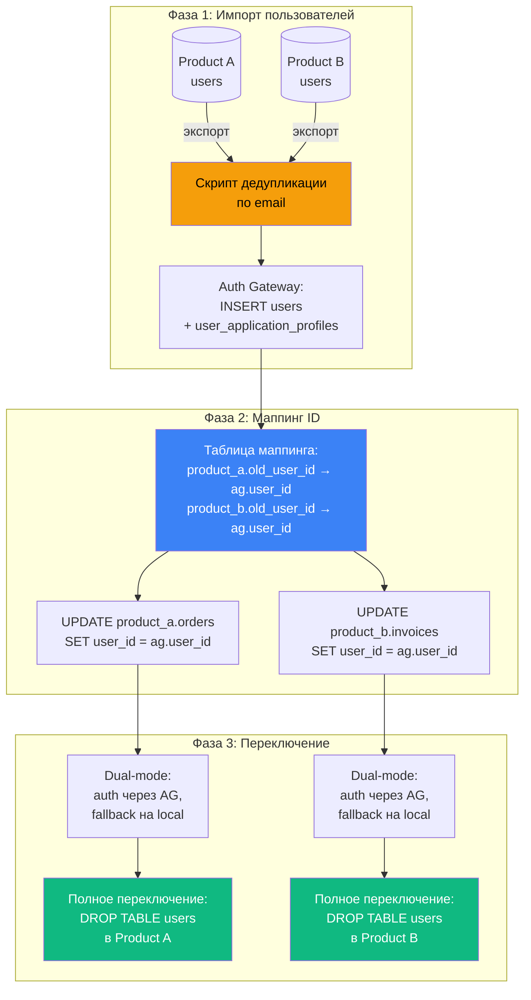
```mermaid
graph TD
    subgraph "Фаза 1: Импорт пользователей"
        PA_USERS[(Product A<br/>users)] -->|экспорт| MERGE[Скрипт дедупликации<br/>по email]
        PB_USERS[(Product B<br/>users)] -->|экспорт| MERGE
        MERGE --> AG_IMPORT[Auth Gateway:<br/>INSERT users<br/>+ user_application_profiles]
    end

subgraph "Фаза 2: Маппинг ID"
AG_IMPORT --> MAP[Таблица маппинга:<br/>product_a.old_user_id → ag.user_id<br/>product_b.old_user_id → ag.user_id]
MAP --> UPDATE_A[UPDATE product_a.orders<br/>SET user_id = ag.user_id]
MAP --> UPDATE_B[UPDATE product_b.invoices<br/>SET user_id = ag.user_id]
end

subgraph "Фаза 3: Переключение"
UPDATE_A --> DUAL_A[Dual-mode:<br/>auth через AG,<br/>fallback на local]
UPDATE_B --> DUAL_B[Dual-mode:<br/>auth через AG,<br/>fallback на local]
DUAL_A --> FULL_A[Полное переключение:<br/>DROP TABLE users<br/>в Product A]
DUAL_B --> FULL_B[Полное переключение:<br/>DROP TABLE users<br/>в Product B]
end

style MERGE fill: #F59E0B,color: #000
style MAP fill: #3B82F6,color: #fff
style FULL_A fill: #10B981,color: #fff
style FULL_B fill: #10B981,color: #fff
```

### Стратегия миграции паролей

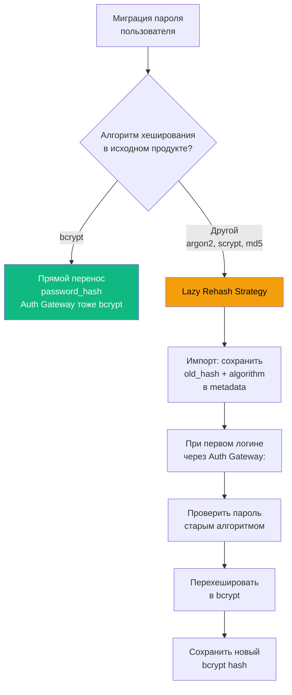
```mermaid
graph TD
    START[Миграция пароля<br/>пользователя] --> CHECK
    CHECK{Алгоритм хеширования<br/>в исходном продукте?}
    CHECK -->|bcrypt| DIRECT[Прямой перенос<br/>password_hash<br/>Auth Gateway тоже bcrypt]
    CHECK -->|Другой<br/>argon2, scrypt, md5| LAZY[Lazy Rehash Strategy]
    LAZY --> IMPORT[Импорт: сохранить<br/>old_hash + algorithm<br/>в metadata]
    IMPORT --> LOGIN[При первом логине<br/>через Auth Gateway:]
    LOGIN --> VERIFY[Проверить пароль<br/>старым алгоритмом]
    VERIFY --> REHASH[Перехешировать<br/>в bcrypt]
    REHASH --> SAVE[Сохранить новый<br/>bcrypt hash]
    style DIRECT fill: #10B981, color: #fff
    style LAZY fill: #F59E0B, color: #000
```

### Конфликты: один email — разные пароли в разных продуктах

```mermaid
graph TD
    CONFLICT[user@mail.com существует<br/>в Product A и Product B<br/>с разными паролями] --> STRATEGY

STRATEGY{Стратегия<br/>разрешения?}

STRATEGY -->|Рекомендуемая|LATEST[Взять пароль из<br/>последнего активного продукта<br/>+ отправить email<br/>для сброса пароля]
STRATEGY -->|Альтернативная|RESET[Принудительный сброс<br/>пароля для всех<br/>конфликтных users]
STRATEGY -->|Безопасная|MANUAL[Пометить как<br/>requires_password_reset<br/>при первом логине —<br/>пользователь сам выбирает]

style MANUAL fill: #10B981, color: #fff
```

---

## 10. Каналы связи (gRPC vs REST)

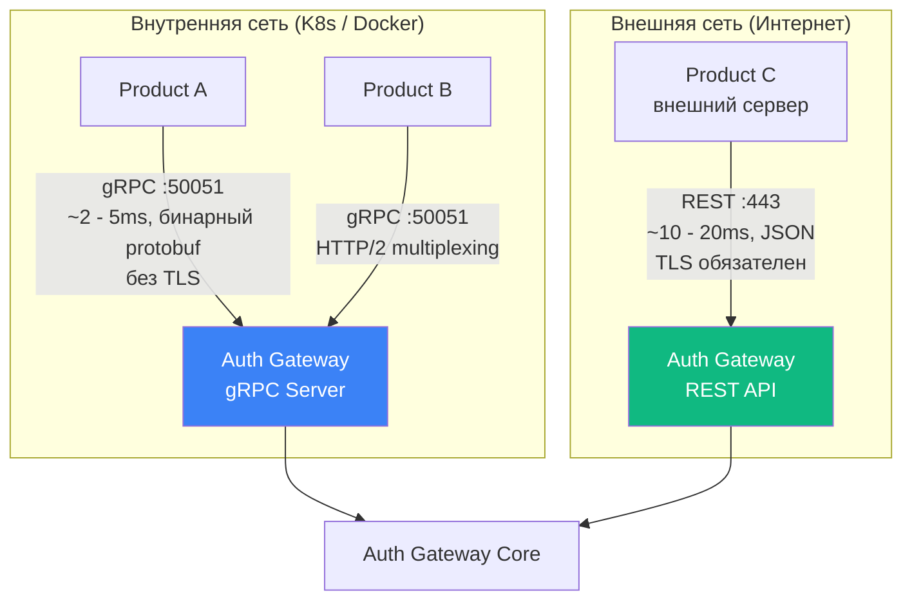
```mermaid
graph TB
    subgraph "Внутренняя сеть (K8s / Docker)"
        A[Product A] -->|gRPC :50051<br/>~2 - 5ms, бинарный protobuf<br/>без TLS| AG_GRPC[Auth Gateway<br/>gRPC Server]
        B[Product B] -->|gRPC :50051<br/>HTTP/2 multiplexing| AG_GRPC
    end

    subgraph "Внешняя сеть (Интернет)"
        C[Product C<br/>внешний сервер] -->|REST :443<br/>~10 - 20ms, JSON<br/>TLS обязателен| AG_REST[Auth Gateway<br/>REST API]
    end

    AG_GRPC --> AG_CORE[Auth Gateway Core]
    AG_REST --> AG_CORE
    style AG_GRPC fill: #3B82F6, color: #fff
    style AG_REST fill: #10B981, color: #fff
```

### Выбор канала

| Критерий     | gRPC                            | REST                       |
|--------------|---------------------------------|----------------------------|
| **Когда**    | Продукт в одной сети с AG       | Продукт на внешнем сервере |
| **Скорость** | ~2-5ms                          | ~10-20ms                   |
| **Формат**   | Protobuf (бинарный)             | JSON                       |
| **Языки**    | Go, Node.js, Python, Java       | Любой                      |
| **SDK**      | `@auth-gateway/client-sdk/grpc` | `@auth-gateway/client-sdk` |
| **TLS**      | Опционально (внутри кластера)   | Обязательно                |

### Авторизация продукта при вызовах

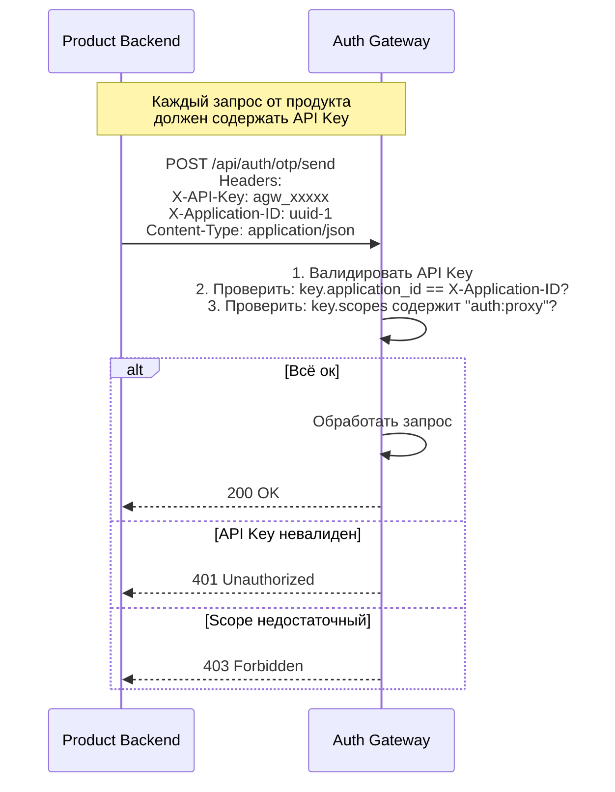
```mermaid
sequenceDiagram
    participant BE as Product Backend
    participant AG as Auth Gateway
    Note over BE, AG: Каждый запрос от продукта<br/>должен содержать API Key
    BE ->> AG: POST /api/auth/otp/send<br/>Headers:<br/> X-API-Key: agw_xxxxx<br/> X-Application-ID: uuid-1<br/> Content-Type: application/json
    AG ->> AG: 1. Валидировать API Key<br/>2. Проверить: key.application_id == X-Application-ID?<br/>3. Проверить: key.scopes содержит "auth:proxy"?

    alt Всё ок
        AG ->> AG: Обработать запрос
        AG -->> BE: 200 OK
    else API Key невалиден
        AG -->> BE: 401 Unauthorized
    else Scope недостаточный
        AG -->> BE: 403 Forbidden
    end
```

---

## 11. Доработки auth-gateway

### Что нужно реализовать

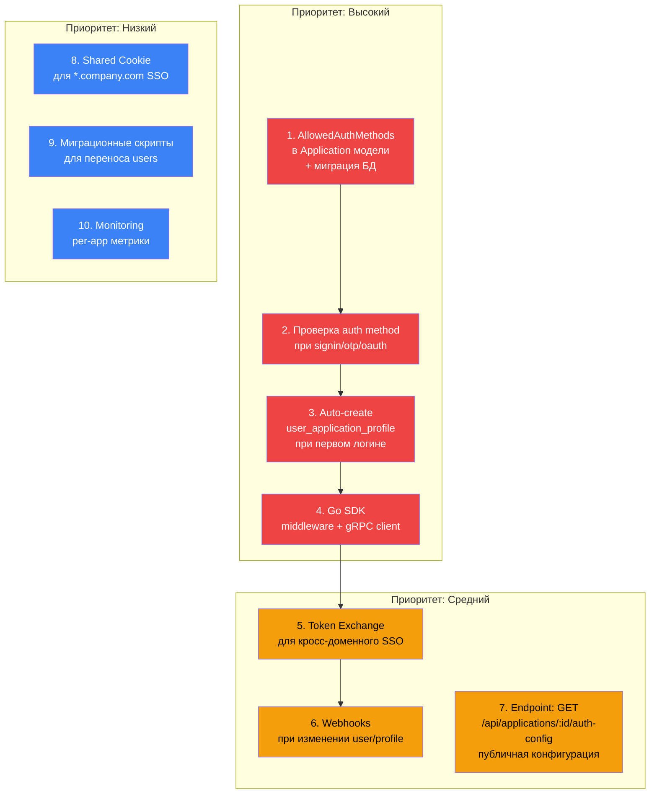
```mermaid
graph TD
    subgraph "Приоритет: Высокий"
        P1[1. AllowedAuthMethods<br/>в Application модели<br/>+ миграция БД]
        P2[2. Проверка auth method<br/>при signin/otp/oauth]
        P3[3. Auto-create<br/>user_application_profile<br/>при первом логине]
        P4[4. Go SDK<br/>middleware + gRPC client]
    end

    subgraph "Приоритет: Средний"
        P5[5. Token Exchange<br/>для кросс-доменного SSO]
        P6[6. Webhooks<br/>при изменении user/profile]
        P7[7. Endpoint: GET<br/>/api/applications/:id/auth-config<br/>публичная конфигурация]
    end

    subgraph "Приоритет: Низкий"
        P8[8. Shared Cookie<br/>для *.company.com SSO]
        P9[9. Миграционные скрипты<br/>для переноса users]
        P10[10. Monitoring<br/>per-app метрики]
    end

    P1 --> P2
    P2 --> P3
    P3 --> P4
    P4 --> P5
    P5 --> P6
    style P1 fill: #EF4444, color: #fff
    style P2 fill: #EF4444, color: #fff
    style P3 fill: #EF4444, color: #fff
    style P4 fill: #EF4444, color: #fff
    style P5 fill: #F59E0B, color: #000
    style P6 fill: #F59E0B, color: #000
    style P7 fill: #F59E0B, color: #000
    style P8 fill: #3B82F6, color: #fff
    style P9 fill: #3B82F6, color: #fff
    style P10 fill: #3B82F6, color: #fff
```

### Изменения в модели Application

```go
type Application struct {
// ... существующие поля (без изменений) ...

// Новое поле
AllowedAuthMethods []string `json:"allowed_auth_methods"
        bun:"allowed_auth_methods,type:jsonb,default:'[\"password\"]'"`
}
```

### Новые API endpoints

| Метод  | Endpoint                            | Описание                                           |
|--------|-------------------------------------|----------------------------------------------------|
| `GET`  | `/api/applications/:id/auth-config` | Публичная конфигурация (allowed methods, branding) |
| `POST` | `/api/auth/token/exchange`          | Создать exchange code для SSO                      |
| `POST` | `/api/auth/token/exchange/redeem`   | Обменять exchange code на токены                   |
| `POST` | `/api/webhooks`                     | Регистрация webhook для продукта                   |

---

## Приложение: Middleware примеры

### Go Middleware (для Go-продуктов)

```go
// Инициализация при старте сервиса
authClient := authgateway.NewClient(authgateway.Config{
GRPCAddress:   "auth-gateway:50051",
APIKey:        os.Getenv("AUTH_GATEWAY_API_KEY"),
ApplicationID: os.Getenv("AUTH_GATEWAY_APP_ID"),
})

// Middleware
router.Use(authClient.GinMiddleware())

// В handler'ах
func GetOrders(c *gin.Context) {
userID := authgateway.GetUserID(c) // UUID
roles := authgateway.GetAppRoles(c) // []string

orders, _ := repo.GetOrdersByUserID(c, userID)
c.JSON(200, orders)
}
```

### Node.js Middleware (для Node.js-продуктов)

```typescript
import { AuthGatewayClient } from '@auth-gateway/client-sdk';

const auth = new AuthGatewayClient({
  baseURL: process.env.AUTH_GATEWAY_URL,
  apiKey: process.env.AUTH_GATEWAY_API_KEY,
  applicationId: process.env.AUTH_GATEWAY_APP_ID,
});

// Express middleware
app.use(auth.expressMiddleware());

// В route handlers
app.get('/api/orders', async (req, res) => {
  const userId = req.auth.userId;        // UUID
  const appRoles = req.auth.appRoles;    // string[]

  const orders = await db.orders.findByUserId(userId);
  res.json(orders);
});
```
