# Headless Identity Provider — Архитектура мультисервисной интеграции

## Оглавление

- [1. Обзор](#1-обзор)
- [2. Общая архитектура](#2-общая-архитектура)
- [3. Регистрация продукта](#3-регистрация-продукта)
- [4. Flows аутентификации](#4-flows-аутентификации)
    - [4.1 OTP Email flow](#41-otp-email-flow)
    - [4.2 Email + Password flow](#42-email--password-flow)
    - [4.3 Универсальный flow (выбор метода)](#43-универсальный-flow-выбор-метода)
- [5. Валидация токенов (защита эндпоинтов)](#5-валидация-токенов-защита-эндпоинтов)
- [6. SSO между продуктами](#6-sso-между-продуктами)
    - [6.1 Shared Cookie (поддомены)](#61-shared-cookie-поддомены)
    - [6.2 Token Exchange (разные домены)](#62-token-exchange-разные-домены)
- [7. Shadow Users Table (хранение данных в продуктах)](#7-shadow-users-table-хранение-данных-в-продуктах)
    - [7.1 Принцип: таблица users остаётся](#71-принцип-таблица-users-остаётся)
    - [7.2 Что меняется в таблице users](#72-что-меняется-в-таблице-users)
    - [7.3 Синхронизация данных](#73-синхронизация-данных)
    - [7.4 Получение данных о пользователе](#74-получение-данных-о-пользователе)
- [8. Миграция существующих пользователей](#8-миграция-существующих-пользователей)
- [9. Каналы связи (gRPC vs REST)](#9-каналы-связи-grpc-vs-rest)
- [10. Доработки auth-gateway](#10-доработки-auth-gateway)

---

## 1. Обзор

### Проблема

В компании несколько продуктов, каждый со своей базой данных. Глобально пользователь один, но в каждом продукте есть
своя таблица `users`, дублирующая данные. Разные продукты используют разные методы аутентификации (OTP, пароль и т.д.).

### Решение

Auth Gateway работает как **Headless Identity Provider** — невидимый для пользователя бэкенд-сервис аутентификации.
Каждый продукт сохраняет свой UI и UX логина, но делегирует проверку credentials в Auth Gateway.

### Ключевые принципы

| Принцип               | Описание                                                                                                              |
|-----------------------|-----------------------------------------------------------------------------------------------------------------------|
| **Headless**          | Пользователь никогда не видит auth-gateway, каждый продукт имеет свой UI логина                                       |
| **Single Identity**   | Один пользователь (UUID) на всю экосистему, без дублирования                                                          |
| **Per-App Config**    | Каждый продукт настраивает свои методы аутентификации, роли, брендинг                                                 |
| **Foreign Reference** | Продукты хранят только `user_id` (UUID), не таблицу `users`                                                           |
| **Backend Proxy**     | Фронтенд продукта → Бэкенд продукта → Auth Gateway (credentials никогда не идут от фронтенда к auth-gateway напрямую) |

---

## 2. Общая архитектура

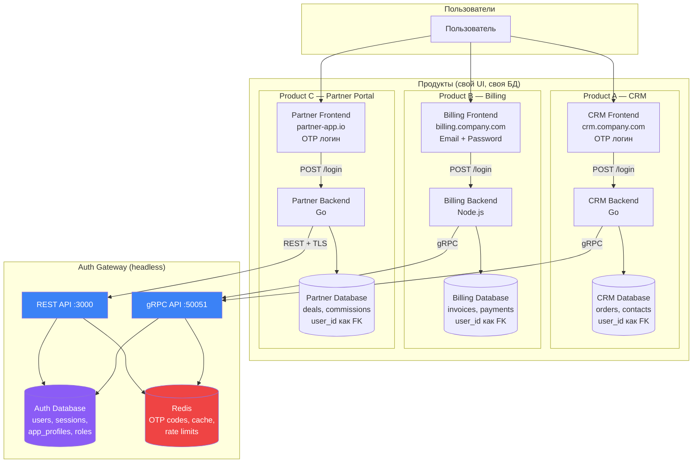
```mermaid
graph TB
    subgraph "Пользователи"
        U1[Пользователь]
    end

    subgraph "Продукты (свой UI, своя БД)"
        subgraph "Product A — CRM"
            A_UI[CRM Frontend<br/>crm.company.com<br/>OTP логин]
            A_BE[CRM Backend<br/>Go]
            A_DB[(CRM Database<br/>orders, contacts<br/>user_id как FK)]
        end

        subgraph "Product B — Billing"
            B_UI[Billing Frontend<br/>billing.company.com<br/>Email + Password]
            B_BE[Billing Backend<br/>Node.js]
            B_DB[(Billing Database<br/>invoices, payments<br/>user_id как FK)]
        end

        subgraph "Product C — Partner Portal"
            C_UI[Partner Frontend<br/>partner-app.io<br/>OTP логин]
            C_BE[Partner Backend<br/>Go]
            C_DB[(Partner Database<br/>deals, commissions<br/>user_id как FK)]
        end
    end

    subgraph "Auth Gateway (headless)"
        AG_REST[REST API :3000]
        AG_GRPC[gRPC API :50051]
        AG_DB[(Auth Database<br/>users, sessions,<br/>app_profiles, roles)]
        AG_REDIS[(Redis<br/>OTP codes, cache,<br/>rate limits)]
    end

    U1 --> A_UI
    U1 --> B_UI
    U1 --> C_UI
    A_UI -->|POST /login| A_BE
    B_UI -->|POST /login| B_BE
    C_UI -->|POST /login| C_BE
    A_BE -->|gRPC| AG_GRPC
    B_BE -->|gRPC| AG_GRPC
    C_BE -->|REST + TLS| AG_REST
    A_BE --> A_DB
    B_BE --> B_DB
    C_BE --> C_DB
    AG_REST --> AG_DB
    AG_GRPC --> AG_DB
    AG_REST --> AG_REDIS
    AG_GRPC --> AG_REDIS
    style AG_REST fill: #3B82F6, color: #fff
    style AG_GRPC fill: #3B82F6, color: #fff
    style AG_DB fill: #8B5CF6, color: #fff
    style AG_REDIS fill: #EF4444, color: #fff
```

### Потоки данных

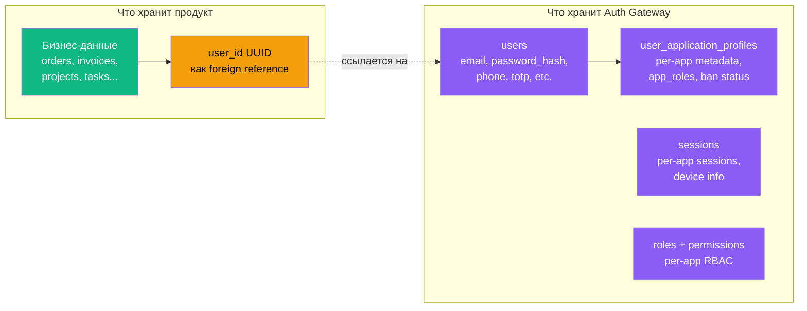
```mermaid
graph LR
    subgraph "Что хранит Auth Gateway"
        AUTH_USERS[users<br/>email, password_hash,<br/>phone, totp, etc.]
        AUTH_PROFILES[user_application_profiles<br/>per-app metadata,<br/>app_roles, ban status]
        AUTH_SESSIONS[sessions<br/>per-app sessions,<br/>device info]
        AUTH_ROLES[roles + permissions<br/>per-app RBAC]
    end

    subgraph "Что хранит продукт"
        PROD_BIZ[Бизнес-данные<br/>orders, invoices,<br/>projects, tasks...]
        PROD_REF[user_id UUID<br/>как foreign reference]
    end

    AUTH_USERS --> AUTH_PROFILES
    PROD_BIZ --> PROD_REF
    PROD_REF -.->|ссылается на| AUTH_USERS
    style AUTH_USERS fill: #8B5CF6, color: #fff
    style AUTH_PROFILES fill: #8B5CF6, color: #fff
    style AUTH_SESSIONS fill: #8B5CF6, color: #fff
    style AUTH_ROLES fill: #8B5CF6, color: #fff
    style PROD_BIZ fill: #10B981, color: #fff
    style PROD_REF fill: #F59E0B, color: #000
```

---

## 3. Регистрация продукта

Перед интеграцией продукт должен быть зарегистрирован в auth-gateway.

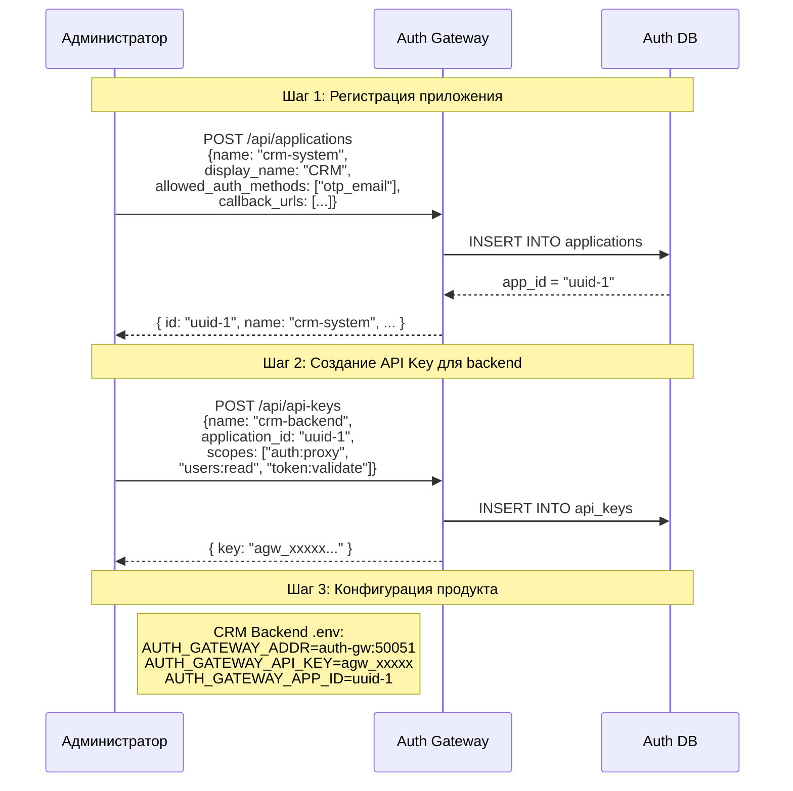
```mermaid
sequenceDiagram
    participant Admin as Администратор
    participant AG as Auth Gateway
    participant DB as Auth DB
    Note over Admin, DB: Шаг 1: Регистрация приложения
    Admin ->> AG: POST /api/applications<br/>{name: "crm-system",<br/>display_name: "CRM",<br/>allowed_auth_methods: ["otp_email"],<br/>callback_urls: [...]}
    AG ->> DB: INSERT INTO applications
    DB -->> AG: app_id = "uuid-1"
    AG -->> Admin: { id: "uuid-1", name: "crm-system", ... }
    Note over Admin, DB: Шаг 2: Создание API Key для backend
    Admin ->> AG: POST /api/api-keys<br/>{name: "crm-backend",<br/>application_id: "uuid-1",<br/>scopes: ["auth:proxy",<br/>"users:read", "token:validate"]}
    AG ->> DB: INSERT INTO api_keys
    AG -->> Admin: { key: "agw_xxxxx..." }
    Note over Admin, DB: Шаг 3: Конфигурация продукта
    Note right of Admin: CRM Backend .env:<br/>AUTH_GATEWAY_ADDR=auth-gw:50051<br/>AUTH_GATEWAY_API_KEY=agw_xxxxx<br/>AUTH_GATEWAY_APP_ID=uuid-1
```

### Конфигурация Application

```json
{
  "name": "crm-system",
  "display_name": "CRM System",
  "homepage_url": "https://crm.company.com",
  "callback_urls": [
    "https://crm.company.com/callback"
  ],
  "allowed_auth_methods": [
    "otp_email"
  ],
  "is_active": true
}
```

### Допустимые значения `allowed_auth_methods`

| Метод          | Описание                   | Пример продукта           |
|----------------|----------------------------|---------------------------|
| `password`     | Email + пароль             | Billing Portal            |
| `otp_email`    | OTP код на email           | CRM, Partner Portal       |
| `otp_sms`      | OTP код по SMS             | Mobile App                |
| `oauth_google` | Вход через Google          | Public SaaS               |
| `oauth_github` | Вход через GitHub          | Dev Tools                 |
| `oauth_yandex` | Вход через Яндекс          | RU-продукты               |
| `totp`         | 2FA (Google Authenticator) | Как дополнение к password |
| `api_key`      | Service-to-service         | Внутренние сервисы        |

---

## 4. Flows аутентификации

### 4.1 OTP Email flow

Для продуктов, где аутентификация — только по коду из email.

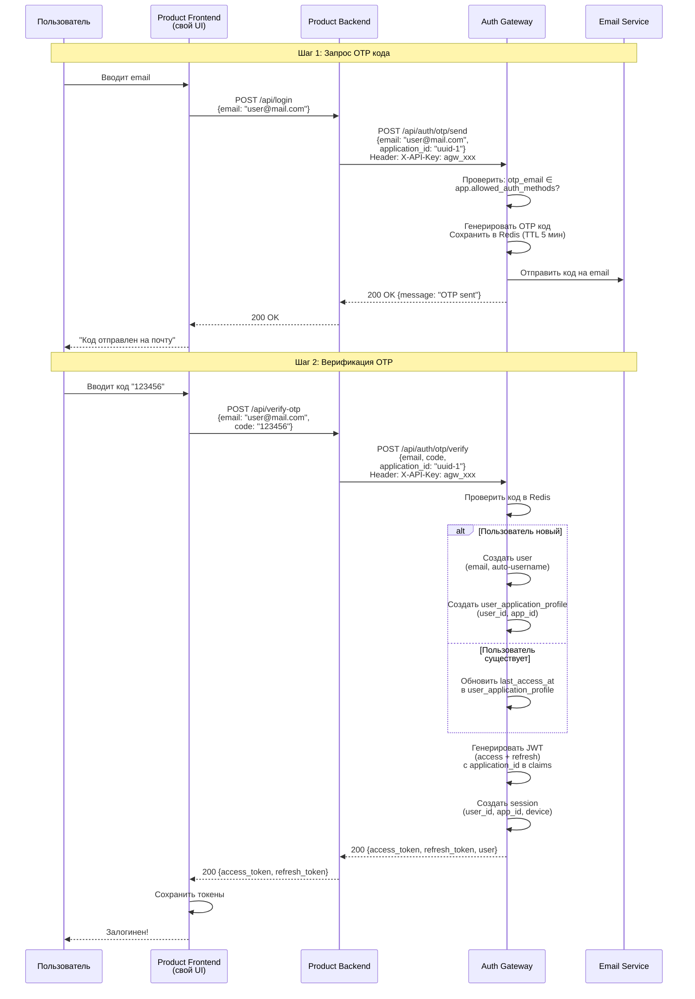
```mermaid
sequenceDiagram
    participant User as Пользователь
    participant FE as Product Frontend<br/>(свой UI)
    participant BE as Product Backend
    participant AG as Auth Gateway
    participant Mail as Email Service
    Note over User, Mail: Шаг 1: Запрос OTP кода
    User ->> FE: Вводит email
    FE ->> BE: POST /api/login<br/>{email: "user@mail.com"}
    BE ->> AG: POST /api/auth/otp/send<br/>{email: "user@mail.com",<br/>application_id: "uuid-1"}<br/>Header: X-API-Key: agw_xxx
    AG ->> AG: Проверить: otp_email ∈<br/>app.allowed_auth_methods?
    AG ->> AG: Генерировать OTP код<br/>Сохранить в Redis (TTL 5 мин)
    AG ->> Mail: Отправить код на email
    AG -->> BE: 200 OK {message: "OTP sent"}
    BE -->> FE: 200 OK
    FE -->> User: "Код отправлен на почту"
    Note over User, Mail: Шаг 2: Верификация OTP
    User ->> FE: Вводит код "123456"
    FE ->> BE: POST /api/verify-otp<br/>{email: "user@mail.com",<br/>code: "123456"}
    BE ->> AG: POST /api/auth/otp/verify<br/>{email, code,<br/>application_id: "uuid-1"}<br/>Header: X-API-Key: agw_xxx
    AG ->> AG: Проверить код в Redis

    alt Пользователь новый
        AG ->> AG: Создать user<br/>(email, auto-username)
        AG ->> AG: Создать user_application_profile<br/>(user_id, app_id)
    else Пользователь существует
        AG ->> AG: Обновить last_access_at<br/>в user_application_profile
    end

    AG ->> AG: Генерировать JWT<br/>(access + refresh)<br/>с application_id в claims
    AG ->> AG: Создать session<br/>(user_id, app_id, device)
    AG -->> BE: 200 {access_token, refresh_token, user}
    BE -->> FE: 200 {access_token, refresh_token}
    FE ->> FE: Сохранить токены
    FE -->> User: Залогинен!
```

### 4.2 Email + Password flow

Для продуктов с классической авторизацией по паролю.

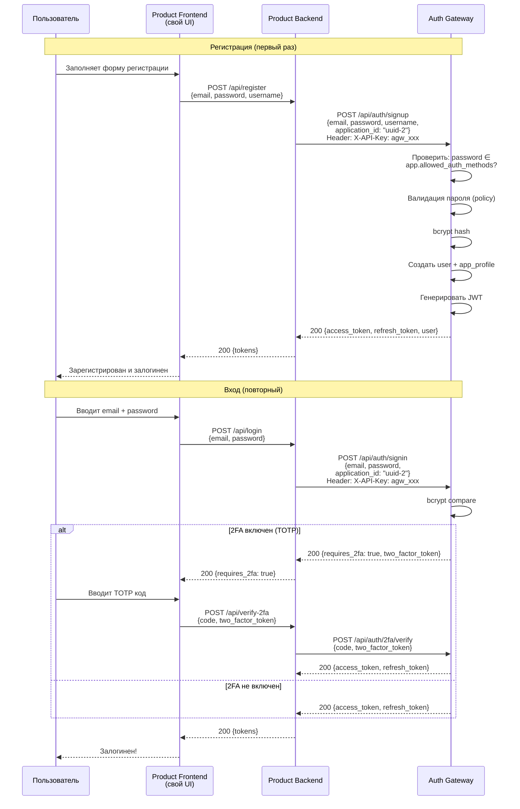
```mermaid
sequenceDiagram
    participant User as Пользователь
    participant FE as Product Frontend<br/>(свой UI)
    participant BE as Product Backend
    participant AG as Auth Gateway
    Note over User, AG: Регистрация (первый раз)
    User ->> FE: Заполняет форму регистрации
    FE ->> BE: POST /api/register<br/>{email, password, username}
    BE ->> AG: POST /api/auth/signup<br/>{email, password, username,<br/>application_id: "uuid-2"}<br/>Header: X-API-Key: agw_xxx
    AG ->> AG: Проверить: password ∈<br/>app.allowed_auth_methods?
    AG ->> AG: Валидация пароля (policy)
    AG ->> AG: bcrypt hash
    AG ->> AG: Создать user + app_profile
    AG ->> AG: Генерировать JWT
    AG -->> BE: 200 {access_token, refresh_token, user}
    BE -->> FE: 200 {tokens}
    FE -->> User: Зарегистрирован и залогинен
    Note over User, AG: Вход (повторный)
    User ->> FE: Вводит email + password
    FE ->> BE: POST /api/login<br/>{email, password}
    BE ->> AG: POST /api/auth/signin<br/>{email, password,<br/>application_id: "uuid-2"}<br/>Header: X-API-Key: agw_xxx
    AG ->> AG: bcrypt compare

    alt 2FA включен (TOTP)
        AG -->> BE: 200 {requires_2fa: true, two_factor_token}
        BE -->> FE: 200 {requires_2fa: true}
        User ->> FE: Вводит TOTP код
        FE ->> BE: POST /api/verify-2fa<br/>{code, two_factor_token}
        BE ->> AG: POST /api/auth/2fa/verify<br/>{code, two_factor_token}
        AG -->> BE: 200 {access_token, refresh_token}
    else 2FA не включен
        AG -->> BE: 200 {access_token, refresh_token}
    end

    BE -->> FE: 200 {tokens}
    FE -->> User: Залогинен!
```

### 4.3 Универсальный flow (выбор метода)

Продукт может поддерживать несколько методов. Выбор делает **фронтенд продукта**, auth-gateway валидирует допустимость.

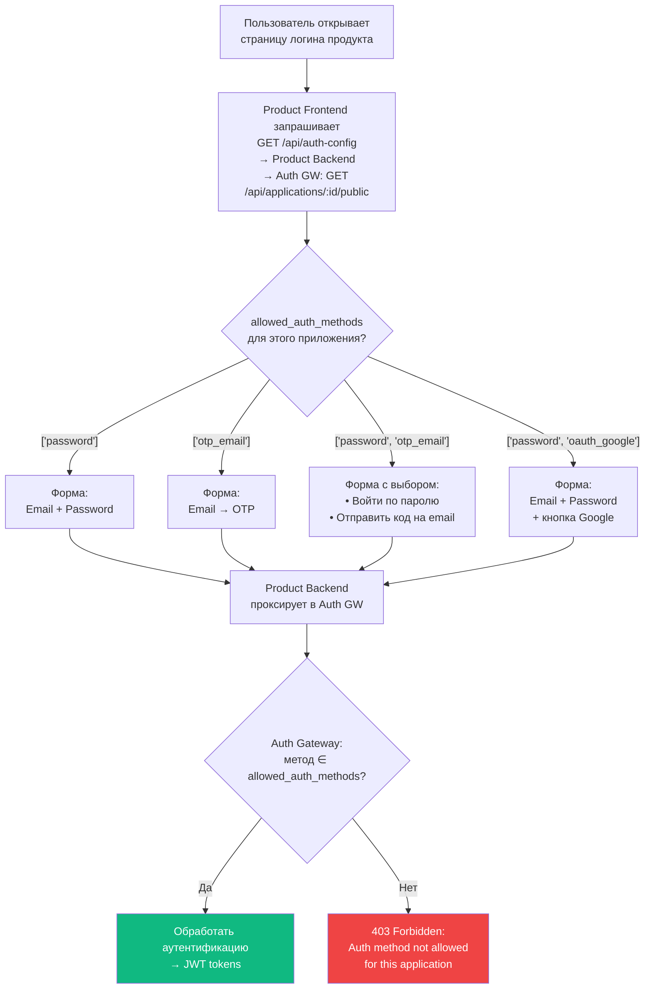
```mermaid
graph TD
    START[Пользователь открывает<br/>страницу логина продукта] --> FETCH
    FETCH[Product Frontend запрашивает<br/>GET /api/auth-config<br/>→ Product Backend<br/>→ Auth GW: GET /api/applications/:id/public]
FETCH --> CONFIG

CONFIG{allowed_auth_methods<br/>для этого приложения?}

CONFIG -->|" ['password'] "|PASS_FORM[Форма:<br/>Email + Password]
CONFIG -->|"['otp_email'] "|OTP_FORM[Форма:<br/>Email → OTP]
CONFIG -->|" ['password', 'otp_email'] "|CHOICE_FORM[Форма с выбором:<br/>• Войти по паролю<br/>• Отправить код на email]
CONFIG -->|" ['password', 'oauth_google']"|MIXED_FORM[Форма:<br/>Email + Password<br/>+ кнопка Google]

PASS_FORM --> BE_PROXY[Product Backend<br/>проксирует в Auth GW]
OTP_FORM --> BE_PROXY
CHOICE_FORM --> BE_PROXY
MIXED_FORM --> BE_PROXY

BE_PROXY --> AG_CHECK{Auth Gateway:<br/>метод ∈ allowed_auth_methods?}
AG_CHECK -->|Да|AG_PROCESS[Обработать аутентификацию<br/>→ JWT tokens]
AG_CHECK -->|Нет|AG_REJECT[403 Forbidden:<br/>Auth method not allowed<br/>for this application]

style AG_PROCESS fill: #10B981, color: #fff
style AG_REJECT fill: #EF4444, color: #fff
```

---

## 5. Валидация токенов (защита эндпоинтов)

Каждый защищённый эндпоинт продукта валидирует JWT через auth-gateway.

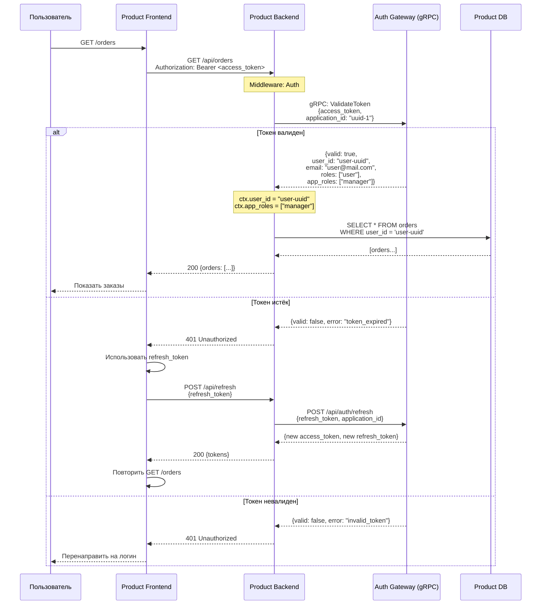
```mermaid
sequenceDiagram
    participant User as Пользователь
    participant FE as Product Frontend
    participant BE as Product Backend
    participant AG as Auth Gateway (gRPC)
    participant DB as Product DB
    User ->> FE: GET /orders
    FE ->> BE: GET /api/orders<br/>Authorization: Bearer <access_token>
    Note over BE: Middleware: Auth
    BE ->> AG: gRPC: ValidateToken<br/>{access_token,<br/>application_id: "uuid-1"}

    alt Токен валиден
        AG -->> BE: {valid: true,<br/>user_id: "user-uuid",<br/>email: "user@mail.com",<br/>roles: ["user"],<br/>app_roles: ["manager"]}
        Note over BE: ctx.user_id = "user-uuid"<br/>ctx.app_roles = ["manager"]
        BE ->> DB: SELECT * FROM orders<br/>WHERE user_id = 'user-uuid'
        DB -->> BE: [orders...]
        BE -->> FE: 200 {orders: [...]}
        FE -->> User: Показать заказы
    else Токен истёк
        AG -->> BE: {valid: false, error: "token_expired"}
        BE -->> FE: 401 Unauthorized
        FE ->> FE: Использовать refresh_token
        FE ->> BE: POST /api/refresh<br/>{refresh_token}
        BE ->> AG: POST /api/auth/refresh<br/>{refresh_token, application_id}
        AG -->> BE: {new access_token, new refresh_token}
        BE -->> FE: 200 {tokens}
        FE ->> FE: Повторить GET /orders
    else Токен невалиден
        AG -->> BE: {valid: false, error: "invalid_token"}
        BE -->> FE: 401 Unauthorized
        FE -->> User: Перенаправить на логин
    end
```

### JWT Claims структура

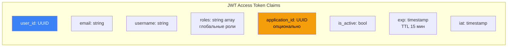
```mermaid
graph LR
    subgraph "JWT Access Token Claims"
        UID[user_id: UUID]
        EMAIL[email: string]
        UNAME[username: string]
        ROLES[roles: string array<br/>глобальные роли]
        APPID[application_id: UUID<br/>опционально]
        ACTIVE[is_active: bool]
        EXP[exp: timestamp<br/>TTL 15 мин]
        IAT[iat: timestamp]
    end

    style APPID fill: #F59E0B, color: #000
    style UID fill: #3B82F6, color: #fff
```

---

## 6. SSO между продуктами

### 6.1 Shared Cookie (поддомены)

Для продуктов на `*.company.com`.

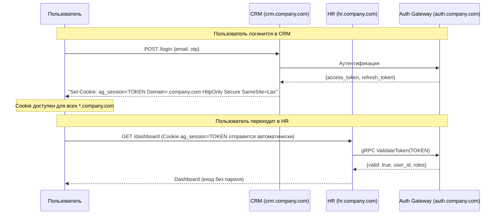
```mermaid
sequenceDiagram
    participant User as Пользователь
    participant CRM as CRM (crm.company.com)
    participant HR as HR (hr.company.com)
    participant AG as Auth Gateway (auth.company.com)
    Note over User, AG: Пользователь логинится в CRM
    User ->> CRM: POST /login {email, otp}
    CRM ->> AG: Аутентификация
    AG -->> CRM: {access_token, refresh_token}
    CRM -->> User: "Set-Cookie: ag_session=TOKEN Domain=.company.com HttpOnly Secure SameSite=Lax"
    Note over User: Cookie доступен для всех *.company.com
    Note over User, AG: Пользователь переходит в HR
    User ->> HR: GET /dashboard (Cookie ag_session=TOKEN отправится автоматически)
    HR ->> AG: gRPC ValidateToken(TOKEN)
    AG -->> HR: {valid: true, user_id, roles}
    HR -->> User: Dashboard (вход без пароля)

```

### 6.2 Token Exchange (разные домены)

Для продуктов на разных доменах (например, `partner-app.io`), где cookie не работает.

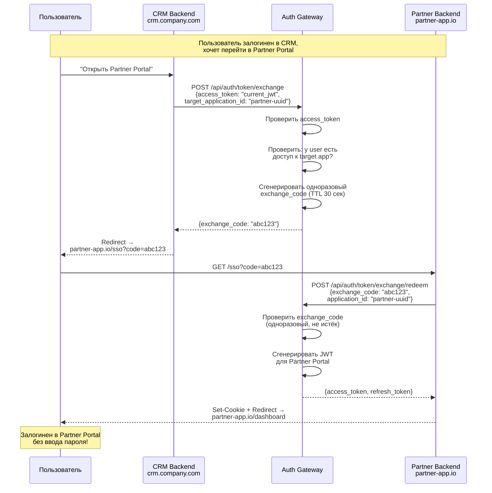
```mermaid
sequenceDiagram
    participant User as Пользователь
    participant CRM as CRM Backend<br/>crm.company.com
    participant AG as Auth Gateway
    participant Partner as Partner Backend<br/>partner-app.io
    Note over User, Partner: Пользователь залогинен в CRM,<br/>хочет перейти в Partner Portal
    User ->> CRM: "Открыть Partner Portal"
    CRM ->> AG: POST /api/auth/token/exchange<br/>{access_token: "current_jwt",<br/>target_application_id: "partner-uuid"}
    AG ->> AG: Проверить access_token
    AG ->> AG: Проверить: у user есть<br/>доступ к target app?
    AG ->> AG: Сгенерировать одноразовый<br/>exchange_code (TTL 30 сек)
    AG -->> CRM: {exchange_code: "abc123"}
    CRM -->> User: Redirect →<br/>partner-app.io/sso?code=abc123
    User ->> Partner: GET /sso?code=abc123
    Partner ->> AG: POST /api/auth/token/exchange/redeem<br/>{exchange_code: "abc123",<br/>application_id: "partner-uuid"}
    AG ->> AG: Проверить exchange_code<br/>(одноразовый, не истёк)
    AG ->> AG: Сгенерировать JWT<br/>для Partner Portal
    AG -->> Partner: {access_token, refresh_token}
    Partner -->> User: Set-Cookie + Redirect →<br/>partner-app.io/dashboard
    Note over User: Залогинен в Partner Portal<br/>без ввода пароля!
```

### Комбинированная SSO стратегия

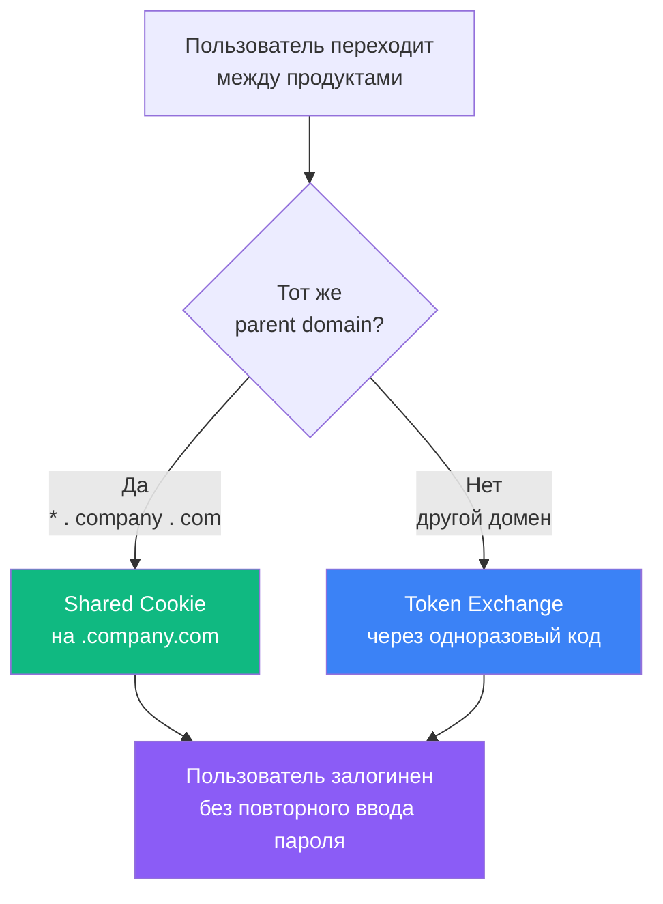
```mermaid
graph TD
    START[Пользователь переходит<br/>между продуктами] --> CHECK_DOMAIN
    CHECK_DOMAIN{Тот же<br/>parent domain?}
    CHECK_DOMAIN -->|Да<br/>* . company . com| COOKIE[Shared Cookie<br/>на .company.com]
    CHECK_DOMAIN -->|Нет<br/>другой домен| EXCHANGE[Token Exchange<br/>через одноразовый код]
    COOKIE --> RESULT[Пользователь залогинен<br/>без повторного ввода пароля]
    EXCHANGE --> RESULT
    style COOKIE fill: #10B981, color: #fff
    style EXCHANGE fill: #3B82F6, color: #fff
    style RESULT fill: #8B5CF6, color: #fff
```

---

## 7. Shadow Users Table (хранение данных в продуктах)

### 7.1 Принцип: таблица users остаётся

Таблица `users` **сохраняется** в каждом продукте для поддержки существующих JOIN-ов и FK constraints. Но она перестаёт
быть source of truth для аутентификации — превращается в **read-only проекцию** (shadow table) данных из Auth Gateway.

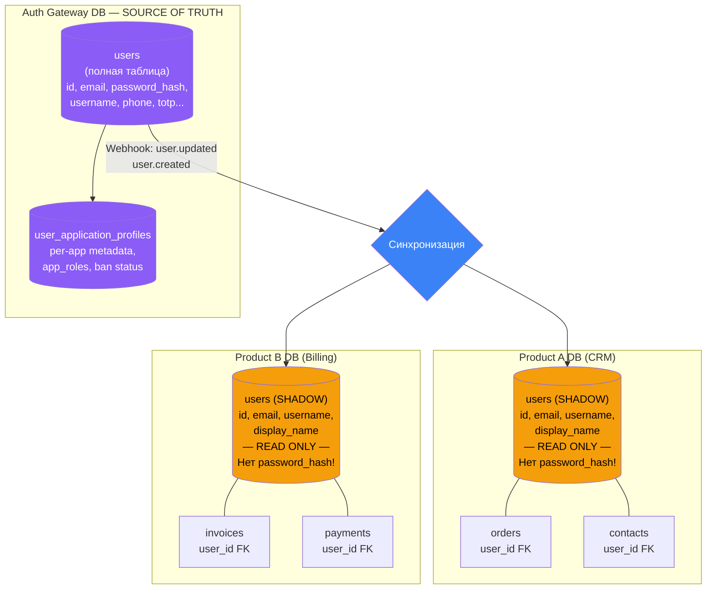
```mermaid
graph TB
    subgraph "Auth Gateway DB — SOURCE OF TRUTH"
        AG_USERS[("users\n(полная таблица)\nid, email, password_hash,\nusername, phone, totp...")]
        AG_PROFILES[("user_application_profiles\nper-app metadata,\napp_roles, ban status")]
        AG_USERS --> AG_PROFILES
    end

    AG_USERS -->|" Webhook: user.updated\nuser.created "| SYNC{Синхронизация}
    SYNC --> PA_USERS
    SYNC --> PB_USERS

    subgraph "Product A DB (CRM)"
        PA_USERS[("users (SHADOW)\nid, email, username,\ndisplay_name\n— READ ONLY —\nНет password_hash!")]
        PA_ORDERS[orders\nuser_id FK]
        PA_CONTACTS[contacts\nuser_id FK]
        PA_USERS --- PA_ORDERS
        PA_USERS --- PA_CONTACTS
    end

    subgraph "Product B DB (Billing)"
        PB_USERS[("users (SHADOW)\nid, email, username,\ndisplay_name\n— READ ONLY —\nНет password_hash!")]
        PB_INVOICES[invoices\nuser_id FK]
        PB_PAYMENTS[payments\nuser_id FK]
        PB_USERS --- PB_INVOICES
        PB_USERS --- PB_PAYMENTS
    end

    style AG_USERS fill: #8B5CF6, color: #fff
    style AG_PROFILES fill: #8B5CF6, color: #fff
    style PA_USERS fill: #F59E0B, color: #000
    style PB_USERS fill: #F59E0B, color: #000
    style SYNC fill: #3B82F6, color: #fff
```

**Ключевые правила Shadow Table:**

| Правило              | Описание                                                                             |
|----------------------|--------------------------------------------------------------------------------------|
| **Read-Only**        | Продукт НИКОГДА не пишет в shadow `users` напрямую (кроме sync)                      |
| **No password_hash** | Пароль хранится ТОЛЬКО в Auth Gateway                                                |
| **Same UUID**        | `users.id` в продукте = `users.id` в Auth Gateway                                    |
| **FK сохранены**     | Все `FOREIGN KEY (user_id) REFERENCES users(id)` работают                            |
| **JOIN-ы работают**  | `SELECT o.*, u.email FROM orders o JOIN users u ON o.user_id = u.id` — без изменений |
| **Source of Truth**  | Auth Gateway. Shadow обновляется через webhook/sync                                  |

### 7.2 Что меняется в таблице users

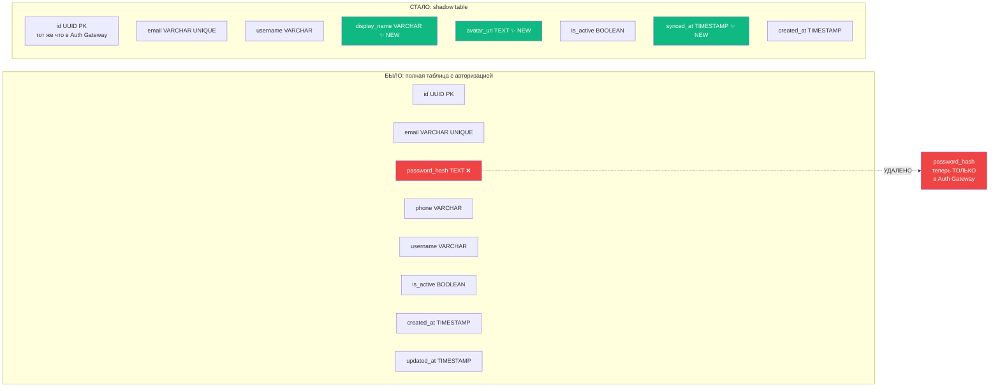
```mermaid
graph LR
subgraph "БЫЛО: полная таблица с авторизацией"
OLD_ID[id UUID PK]
OLD_EMAIL[email VARCHAR UNIQUE]
OLD_PASS[password_hash TEXT ❌]
OLD_PHONE[phone VARCHAR]
OLD_NAME[username VARCHAR]
OLD_ACTIVE[is_active BOOLEAN]
OLD_CREATED[created_at TIMESTAMP]
OLD_UPDATED[updated_at TIMESTAMP]
end

subgraph "СТАЛО: shadow table"
NEW_ID[id UUID PK\nтот же что в Auth Gateway]
NEW_EMAIL[email VARCHAR UNIQUE]
NEW_NAME[username VARCHAR]
NEW_DISPLAY[display_name VARCHAR ✨ NEW]
NEW_AVATAR[avatar_url TEXT ✨ NEW]
NEW_ACTIVE[is_active BOOLEAN]
NEW_SYNCED[synced_at TIMESTAMP ✨ NEW]
NEW_CREATED[created_at TIMESTAMP]
end

OLD_PASS -.->|УДАЛЕНО|REMOVED[password_hash\nтеперь ТОЛЬКО\nв Auth Gateway]

style OLD_PASS fill: #EF4444, color: #fff
style REMOVED fill: #EF4444, color: #fff
style NEW_DISPLAY fill: #10B981, color: #fff
style NEW_AVATAR fill: #10B981, color: #fff
style NEW_SYNCED fill: #10B981, color: #fff
```

**SQL-миграция для продукта:**

```sql
-- Миграция shadow table: убираем авторизацию, добавляем sync-поля

-- Шаг 1: Убрать поля авторизации
ALTER TABLE users
    DROP COLUMN IF EXISTS password_hash;
ALTER TABLE users
    DROP COLUMN IF EXISTS totp_secret;
ALTER TABLE users
    DROP COLUMN IF EXISTS totp_enabled;

-- Шаг 2: Добавить поля из app profile
ALTER TABLE users
    ADD COLUMN IF NOT EXISTS display_name VARCHAR(255);
ALTER TABLE users
    ADD COLUMN IF NOT EXISTS avatar_url TEXT;
ALTER TABLE users
    ADD COLUMN IF NOT EXISTS synced_at TIMESTAMP DEFAULT NOW();

-- Шаг 3: Все существующие FK и JOIN-ы продолжают работать!
-- SELECT o.*, u.email, u.display_name
-- FROM orders o
-- JOIN users u ON o.user_id = u.id
-- ☝️ Этот запрос работает как раньше
```

### 7.3 Синхронизация данных

Три стратегии синхронизации shadow table — от простой к сложной.

#### Стратегия A: Sync-on-Login (простейшая, рекомендуемая для старта)

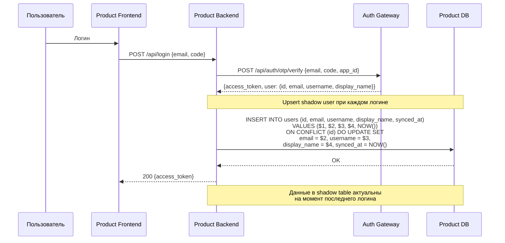
```mermaid
sequenceDiagram
    participant User as Пользователь
    participant FE as Product Frontend
    participant BE as Product Backend
    participant AG as Auth Gateway
    participant DB as Product DB
    User ->> FE: Логин
    FE ->> BE: POST /api/login {email, code}
    BE ->> AG: POST /api/auth/otp/verify {email, code, app_id}
    AG -->> BE: {access_token, user: {id, email, username, display_name}}
    Note over BE, DB: Upsert shadow user при каждом логине
    BE ->> DB: INSERT INTO users (id, email, username, display_name, synced_at)<br/>VALUES ($1, $2, $3, $4, NOW())<br/>ON CONFLICT (id) DO UPDATE SET<br/>email = $2, username = $3,<br/>display_name = $4, synced_at = NOW()
    DB -->> BE: OK
    BE -->> FE: 200 {access_token}
    Note over BE, DB: Данные в shadow table актуальны<br/>на момент последнего логина
```

**Плюсы:** Нет дополнительной инфраструктуры, просто upsert при логине.
**Минусы:** Данные устаревают между логинами (email сменился, а в shadow table старый).

#### Стратегия B: Webhooks (рекомендуемая для прода)

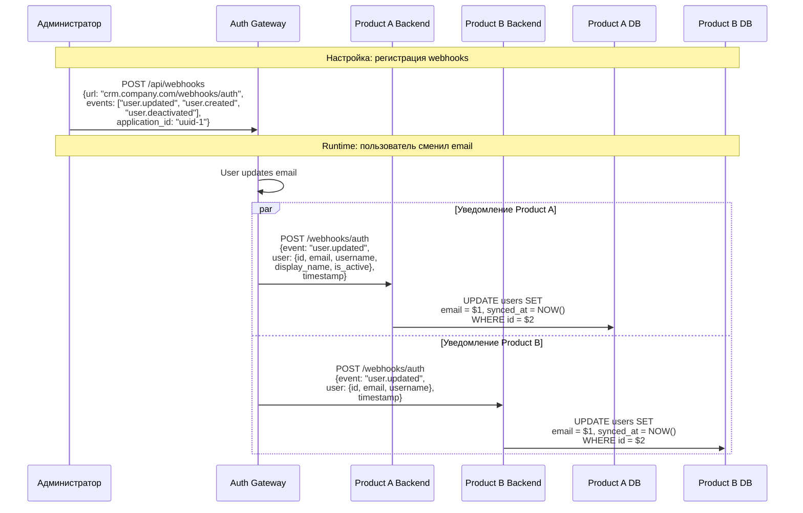
```mermaid
sequenceDiagram
    participant Admin as Администратор
    participant AG as Auth Gateway
    participant PA as Product A Backend
    participant PB as Product B Backend
    participant PA_DB as Product A DB
    participant PB_DB as Product B DB
    Note over Admin, PB_DB: Настройка: регистрация webhooks
    Admin ->> AG: POST /api/webhooks<br/>{url: "crm.company.com/webhooks/auth",<br/>events: ["user.updated", "user.created",<br/>"user.deactivated"],<br/>application_id: "uuid-1"}
    Note over Admin, PB_DB: Runtime: пользователь сменил email
    AG ->> AG: User updates email

    par Уведомление Product A
        AG ->> PA: POST /webhooks/auth<br/>{event: "user.updated",<br/>user: {id, email, username,<br/>display_name, is_active},<br/>timestamp}
        PA ->> PA_DB: UPDATE users SET<br/>email = $1, synced_at = NOW()<br/>WHERE id = $2
    and Уведомление Product B
        AG ->> PB: POST /webhooks/auth<br/>{event: "user.updated",<br/>user: {id, email, username},<br/>timestamp}
        PB ->> PB_DB: UPDATE users SET<br/>email = $1, synced_at = NOW()<br/>WHERE id = $2
    end
```

**Webhook events:**

| Event              | Когда                          | Что делать в продукте                       |
|--------------------|--------------------------------|---------------------------------------------|
| `user.created`     | Регистрация через Auth GW      | `INSERT INTO users (shadow)`                |
| `user.updated`     | Смена email, username, profile | `UPDATE users SET ...`                      |
| `user.deactivated` | Деактивация аккаунта           | `UPDATE users SET is_active = false`        |
| `user.deleted`     | Удаление аккаунта              | `UPDATE users SET is_active = false` (soft) |
| `profile.updated`  | Смена app-specific данных      | `UPDATE users SET display_name = ...`       |

#### Стратегия C: Periodic Sync (для batch-операций)

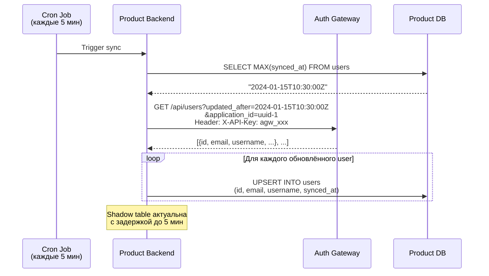
```mermaid
sequenceDiagram
    participant Cron as Cron Job<br/>(каждые 5 мин)
    participant BE as Product Backend
    participant AG as Auth Gateway
    participant DB as Product DB
    Cron ->> BE: Trigger sync
    BE ->> DB: SELECT MAX(synced_at) FROM users
    DB -->> BE: "2024-01-15T10:30:00Z"
    BE ->> AG: GET /api/users?updated_after=2024-01-15T10:30:00Z<br/>&application_id=uuid-1<br/>Header: X-API-Key: agw_xxx
    AG -->> BE: [{id, email, username, ...}, ...]

    loop Для каждого обновлённого user
        BE ->> DB: UPSERT INTO users<br/>(id, email, username, synced_at)
    end

    Note over BE: Shadow table актуальна<br/>с задержкой до 5 мин
```

#### Комбинированная стратегия (рекомендуемая)

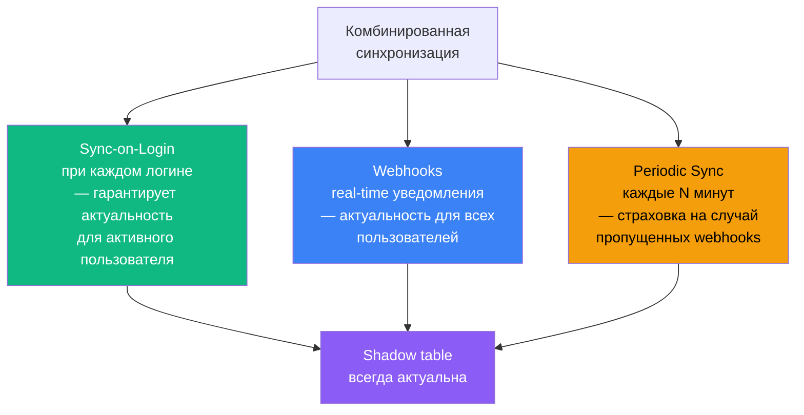
```mermaid
graph TD
    STRATEGY[Комбинированная<br/>синхронизация] --> A
    STRATEGY --> B
    STRATEGY --> C
    A[Sync-on-Login<br/>при каждом логине<br/>— гарантирует актуальность<br/>для активного пользователя]
B[Webhooks<br/>real-time уведомления<br/>— актуальность для всех<br/>пользователей]
C[Periodic Sync<br/>каждые N минут<br/>— страховка на случай<br/>пропущенных webhooks]

A --> RESULT[Shadow table<br/>всегда актуальна]
B --> RESULT
C --> RESULT

style A fill: #10B981, color: #fff
style B fill: #3B82F6, color: #fff
style C fill: #F59E0B, color: #000
style RESULT fill: #8B5CF6, color: #fff
```

### 7.4 Получение данных о пользователе

С shadow table большинство запросов работают **локально, без сетевых вызовов**.

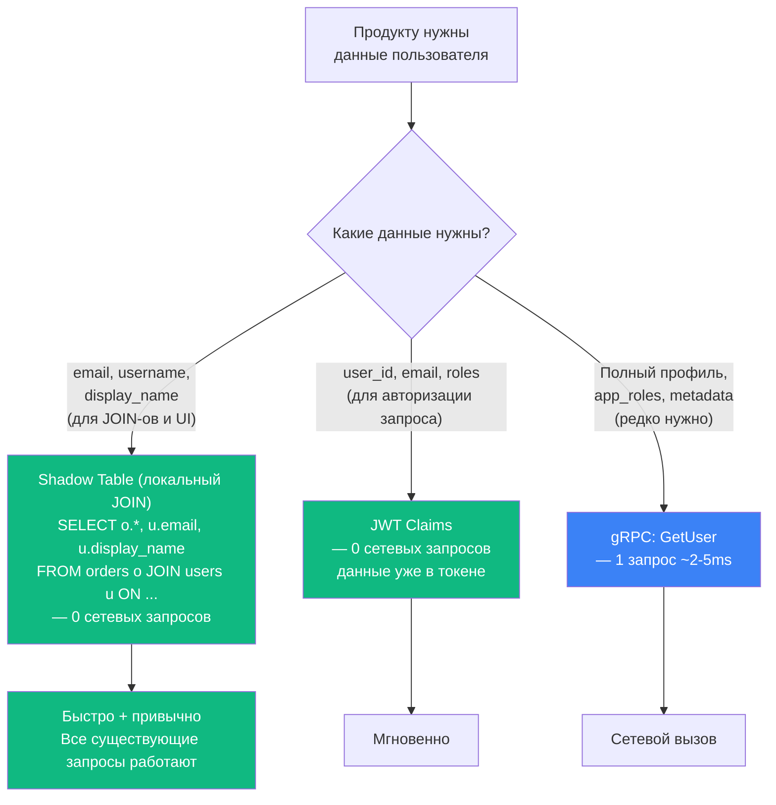
```mermaid
graph TD
    NEED[Продукту нужны<br/>данные пользователя] --> CHOOSE
    CHOOSE{Какие данные нужны?}
    CHOOSE -->|" email, username,\ndisplay_name\n(для JOIN-ов и UI) "| SHADOW["Shadow Table (локальный JOIN)\nSELECT o.*, u.email, u.display_name\nFROM orders o JOIN users u ON ...\n— 0 сетевых запросов"]
    CHOOSE -->|" user_id, email, roles\n(для авторизации запроса) "| JWT["JWT Claims\n— 0 сетевых запросов\nданные уже в токене"]
    CHOOSE -->|" Полный профиль,\napp_roles, metadata\n(редко нужно) "| GRPC["gRPC: GetUser\n— 1 запрос ~2-5ms"]
    SHADOW --> FAST["Быстро + привычно\nВсе существующие запросы работают"]
    JWT --> FAST2[Мгновенно]
    GRPC --> SLOW[Сетевой вызов]
    style SHADOW fill: #10B981, color: #fff
    style JWT fill: #10B981, color: #fff
    style GRPC fill: #3B82F6, color: #fff
    style FAST fill: #10B981, color: #fff
```

**Пример: список заказов с именами — никаких внешних вызовов:**

```sql
-- Этот запрос работает ЛОКАЛЬНО, без обращения к Auth Gateway!
-- Shadow table содержит все нужные данные для отображения.

SELECT o.id,
       o.product_name,
       o.amount,
       o.status,
       o.created_at,
       u.email,
       u.username,
       u.display_name,
       u.avatar_url
FROM orders o
         JOIN users u ON o.user_id = u.id
WHERE o.status = 'active'
ORDER BY o.created_at DESC
LIMIT 20;
```

---

## 8. Миграция существующих пользователей

Для продуктов, которые уже в проде со своими таблицами `users`.

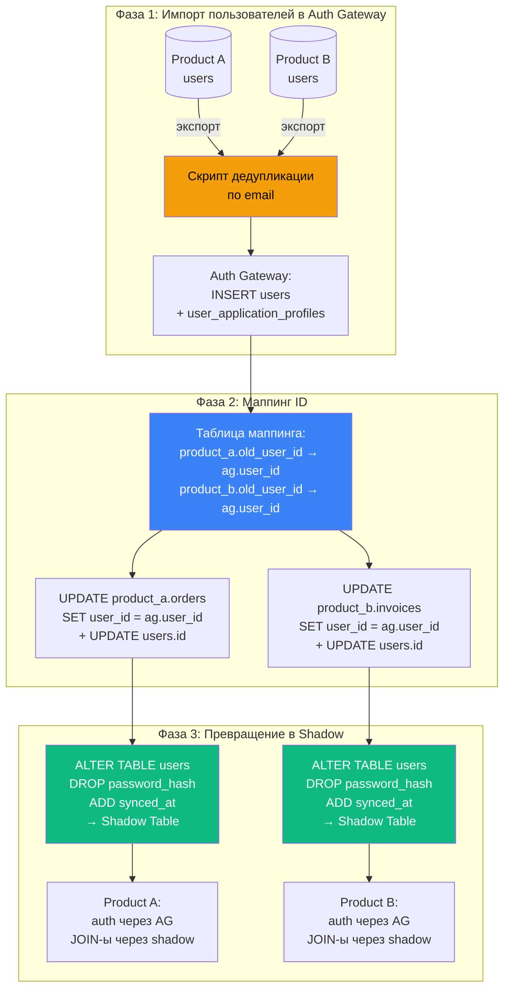
```mermaid
graph TD
    subgraph "Фаза 1: Импорт пользователей в Auth Gateway"
        PA_USERS[(Product A\nusers)] -->|экспорт| MERGE[Скрипт дедупликации\nпо email]
        PB_USERS[(Product B\nusers)] -->|экспорт| MERGE
        MERGE --> AG_IMPORT[Auth Gateway:\nINSERT users\n+ user_application_profiles]
    end

subgraph "Фаза 2: Маппинг ID"
AG_IMPORT --> MAP[Таблица маппинга:\nproduct_a.old_user_id → ag.user_id\nproduct_b.old_user_id → ag.user_id]
MAP --> UPDATE_A[UPDATE product_a.orders\nSET user_id = ag.user_id\n+ UPDATE users.id]
MAP --> UPDATE_B[UPDATE product_b.invoices\nSET user_id = ag.user_id\n+ UPDATE users.id]
end

subgraph "Фаза 3: Превращение в Shadow"
UPDATE_A --> SHADOW_A[ALTER TABLE users\nDROP password_hash\nADD synced_at\n→ Shadow Table]
UPDATE_B --> SHADOW_B[ALTER TABLE users\nDROP password_hash\nADD synced_at\n→ Shadow Table]
SHADOW_A --> DONE_A[Product A:\nauth через AG\nJOIN-ы через shadow]
SHADOW_B --> DONE_B[Product B:\nauth через AG\nJOIN-ы через shadow]
end

style MERGE fill: #F59E0B,color: #000
style MAP fill: #3B82F6,color: #fff
style SHADOW_A fill: #10B981,color: #fff
style SHADOW_B fill: #10B981,color: #fff
```

### Стратегия миграции паролей

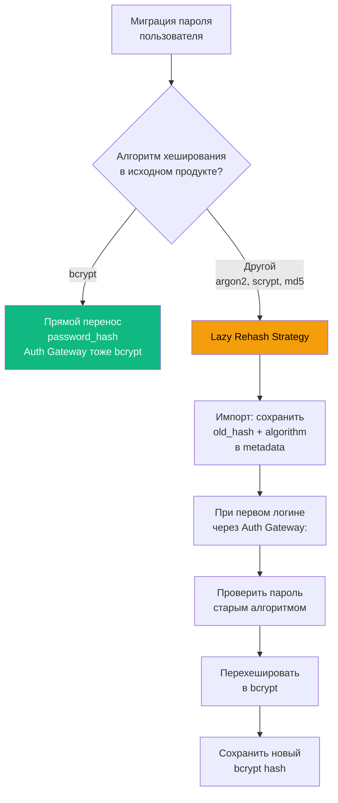
```mermaid
graph TD
    START[Миграция пароля\nпользователя] --> CHECK
    CHECK{Алгоритм хеширования\nв исходном продукте?}
    CHECK -->|bcrypt| DIRECT[Прямой перенос\npassword_hash\nAuth Gateway тоже bcrypt]
    CHECK -->|Другой\nargon2, scrypt, md5| LAZY[Lazy Rehash Strategy]
    LAZY --> IMPORT[Импорт: сохранить\nold_hash + algorithm\nв metadata]
    IMPORT --> LOGIN[При первом логине\nчерез Auth Gateway:]
    LOGIN --> VERIFY[Проверить пароль\nстарым алгоритмом]
    VERIFY --> REHASH[Перехешировать\nв bcrypt]
    REHASH --> SAVE[Сохранить новый\nbcrypt hash]
    style DIRECT fill: #10B981, color: #fff
    style LAZY fill: #F59E0B, color: #000
```

### Конфликты: один email — разные пароли в разных продуктах

```mermaid
graph TD
    CONFLICT[user@mail.com существует\nв Product A и Product B\nс разными паролями] --> STRATEGY

STRATEGY{Стратегия\nразрешения?}

STRATEGY -->|Рекомендуемая|LATEST[Взять пароль из\nпоследнего активного продукта\n+ отправить email\nдля сброса пароля]
STRATEGY -->|Альтернативная|RESET[Принудительный сброс\nпароля для всех\nконфликтных users]
STRATEGY -->|Безопасная|MANUAL[Пометить как\nrequires_password_reset\nпри первом логине —\nпользователь сам выбирает]

style MANUAL fill: #10B981, color: #fff
```

### Поэтапный переход для каждого продукта

```mermaid
graph LR
    subgraph "Этап 1: Dual-Mode (1-2 недели)"
        D1[Логин: Auth Gateway]
        D2[Fallback: локальная users]
        D3[Shadow sync включён]
    end

    subgraph "Этап 2: AG-Only Auth (1 неделя)"
        E1[Логин: только Auth Gateway]
        E2[Shadow table обновляется]
        E3[Мониторинг ошибок]
    end

    subgraph "Этап 3: Cleanup"
        F1[DROP password_hash]
        F2[Финальная миграция]
        F3[Shadow table = единственная users]
    end

    D1 --> E1
    E1 --> F1
    style D1 fill: #F59E0B, color: #000
    style E1 fill: #3B82F6, color: #fff
    style F1 fill: #10B981, color: #fff
```

---

## 9. Каналы связи (gRPC vs REST)

```mermaid
graph TB
    subgraph "Внутренняя сеть (K8s / Docker)"
        A[Product A] -->|gRPC :50051<br/>~2 - 5ms, бинарный protobuf<br/>без TLS| AG_GRPC[Auth Gateway<br/>gRPC Server]
        B[Product B] -->|gRPC :50051<br/>HTTP/2 multiplexing| AG_GRPC
    end

    subgraph "Внешняя сеть (Интернет)"
        C[Product C<br/>внешний сервер] -->|REST :443<br/>~10 - 20ms, JSON<br/>TLS обязателен| AG_REST[Auth Gateway<br/>REST API]
    end

    AG_GRPC --> AG_CORE[Auth Gateway Core]
    AG_REST --> AG_CORE
    style AG_GRPC fill: #3B82F6, color: #fff
    style AG_REST fill: #10B981, color: #fff
```

### Выбор канала

| Критерий     | gRPC                            | REST                       |
|--------------|---------------------------------|----------------------------|
| **Когда**    | Продукт в одной сети с AG       | Продукт на внешнем сервере |
| **Скорость** | ~2-5ms                          | ~10-20ms                   |
| **Формат**   | Protobuf (бинарный)             | JSON                       |
| **Языки**    | Go, Node.js, Python, Java       | Любой                      |
| **SDK**      | `@auth-gateway/client-sdk/grpc` | `@auth-gateway/client-sdk` |
| **TLS**      | Опционально (внутри кластера)   | Обязательно                |

### Авторизация продукта при вызовах

```mermaid
sequenceDiagram
    participant BE as Product Backend
    participant AG as Auth Gateway
    Note over BE, AG: Каждый запрос от продукта<br/>должен содержать API Key
    BE ->> AG: POST /api/auth/otp/send<br/>Headers:<br/> X-API-Key: agw_xxxxx<br/> X-Application-ID: uuid-1<br/> Content-Type: application/json
    AG ->> AG: 1. Валидировать API Key<br/>2. Проверить: key.application_id == X-Application-ID?<br/>3. Проверить: key.scopes содержит "auth:proxy"?

    alt Всё ок
        AG ->> AG: Обработать запрос
        AG -->> BE: 200 OK
    else API Key невалиден
        AG -->> BE: 401 Unauthorized
    else Scope недостаточный
        AG -->> BE: 403 Forbidden
    end
```

---

## 10. Доработки auth-gateway

### Что нужно реализовать

```mermaid
graph TD
    subgraph "Приоритет: Высокий"
        P1[1. AllowedAuthMethods\nв Application модели\n+ миграция БД]
        P2[2. Проверка auth method\nпри signin/otp/oauth]
        P3[3. Auto-create\nuser_application_profile\nпри первом логине]
        P4[4. Webhooks\nuser.created/updated/deactivated\nдля sync shadow tables]
        P5[5. Go SDK\nmiddleware + gRPC client\n+ shadow sync helper]
    end

    subgraph "Приоритет: Средний"
        P6[6. Token Exchange\nдля кросс-доменного SSO]
        P7[7. Endpoint: GET\n/api/applications/:id/auth-config\nпубличная конфигурация]
        P8[8. GET /api/users\n?updated_after=timestamp\nдля periodic sync]
    end

    subgraph "Приоритет: Низкий"
        P9[9. Shared Cookie\nдля *.company.com SSO]
        P10[10. Миграционные скрипты\nдля переноса users]
        P11[11. Monitoring\nper-app метрики]
    end

    P1 --> P2
    P2 --> P3
    P3 --> P4
    P4 --> P5
    P5 --> P6
    style P1 fill: #EF4444, color: #fff
    style P2 fill: #EF4444, color: #fff
    style P3 fill: #EF4444, color: #fff
    style P4 fill: #EF4444, color: #fff
    style P5 fill: #EF4444, color: #fff
    style P6 fill: #F59E0B, color: #000
    style P7 fill: #F59E0B, color: #000
    style P8 fill: #F59E0B, color: #000
    style P9 fill: #3B82F6, color: #fff
    style P10 fill: #3B82F6, color: #fff
    style P11 fill: #3B82F6, color: #fff
```

### Изменения в модели Application

```go
type Application struct {
// ... существующие поля (без изменений) ...

// Новое поле
AllowedAuthMethods []string `json:"allowed_auth_methods"
        bun:"allowed_auth_methods,type:jsonb,default:'[\"password\"]'"`
}
```

### Новые API endpoints

| Метод  | Endpoint                            | Описание                                           |
|--------|-------------------------------------|----------------------------------------------------|
| `GET`  | `/api/applications/:id/auth-config` | Публичная конфигурация (allowed methods, branding) |
| `POST` | `/api/auth/token/exchange`          | Создать exchange code для SSO                      |
| `POST` | `/api/auth/token/exchange/redeem`   | Обменять exchange code на токены                   |
| `POST` | `/api/webhooks`                     | Регистрация webhook для продукта                   |

---

## Приложение: Middleware примеры

### Go Middleware (для Go-продуктов)

```go
// Инициализация при старте сервиса
authClient := authgateway.NewClient(authgateway.Config{
GRPCAddress:   "auth-gateway:50051",
APIKey:        os.Getenv("AUTH_GATEWAY_API_KEY"),
ApplicationID: os.Getenv("AUTH_GATEWAY_APP_ID"),
})

// Middleware
router.Use(authClient.GinMiddleware())

// В handler'ах
func GetOrders(c *gin.Context) {
userID := authgateway.GetUserID(c) // UUID
roles := authgateway.GetAppRoles(c) // []string

orders, _ := repo.GetOrdersByUserID(c, userID)
c.JSON(200, orders)
}
```

### Node.js Middleware (для Node.js-продуктов)

```typescript
import { AuthGatewayClient } from '@auth-gateway/client-sdk';

const auth = new AuthGatewayClient({
  baseURL: process.env.AUTH_GATEWAY_URL,
  apiKey: process.env.AUTH_GATEWAY_API_KEY,
  applicationId: process.env.AUTH_GATEWAY_APP_ID,
});

// Express middleware
app.use(auth.expressMiddleware());

// В route handlers
app.get('/api/orders', async (req, res) => {
  const userId = req.auth.userId;        // UUID
  const appRoles = req.auth.appRoles;    // string[]

  const orders = await db.orders.findByUserId(userId);
  res.json(orders);
});
```
